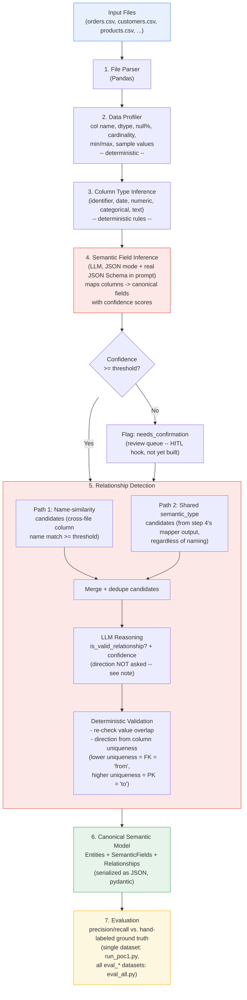

%% POC 1 - Schema Discovery + Relationship Detection (revised at closure)
%% InsightFlow Project
%%
%% Revision note: this replaces the original planning-stage diagram. Changes from the
%% original plan, found while building and stress-testing the pipeline across 8 eval
%% datasets:
%%   - Candidate generation is TWO independent paths merged together, not one step.
%%     Path 1 (name similarity) alone missed real relationships between cryptically-named
%%     columns (eval_hard, eval_real_olist's "buyer_ref"/"cust_ref"-style real IDs). Path 2
%%     (shared semantic_type from the mapper) was added specifically to catch those.
%%   - The LLM's job in relationship detection was narrowed. It originally also judged
%%     *direction*; that was found to be unreliable and was never actually wired into the
%%     final Relationship object anyway. Direction is now decided deterministically from
%%     column uniqueness (FK = lower uniqueness -> PK = higher uniqueness), not the LLM.
%%   - Structured LLM output uses JSON mode with the real pydantic JSON Schema in the
%%     prompt, not LangChain's default function-calling method — several Groq-hosted
%%     models answered in prose instead of calling the forced tool under function-calling.
%%   - The evaluation harness grew a second script, eval_all.py, that runs every eval_*
%%     dataset through steps 1-6 and scores each one, not just a single manual run.
%%   - "Confidence calibration" (step 7) was never implemented — evaluation is
%%     precision/recall only. Removed from this diagram rather than left as an
%%     aspirational label.

## Known gaps this diagram doesn't show (carried forward, not fixed)

- **Hub-and-spoke false positives**: if the same key appears in 3+ files (e.g. `order_id` in
  `orders`, `order_items`, and `payments`), step 5 can validate a direct relationship between
  two files that are only actually related *transitively*, through a third. Found via
  `eval_real_olist`; not yet fixed.
- **Direction on a genuine uniqueness tie** (both sides equally unique) falls back to whatever
  order files were passed to the pipeline in — not deterministic across different call orders.
  Found via `eval_real_olist`; not yet fixed.
- **No same-file (self-referential) relationship detection** — step 5's candidate generation
  only ever compares columns across *different* files. This is a scope decision, documented via
  `eval_selfref`, not a bug being chased.
