# POC 2 — Class Diagram
## Analytics Engine (InsightFlow)

> **Status:** Implemented and verified end-to-end against a sample dataset (see "Decisions made
> during implementation" below for what changed from the pre-implementation sketch, the same way
> this happened once for POC 1's diagram). This was drawn before implementation to finalize
> classes/methods per `poc1_schema_discovery/docs/class_diagram.md`'s pattern; kept up to date
> here rather than left stale now that the code exists.
>
> **Found while drawing this diagram (worth flagging now, before code):** `supported_metrics.md`
> classified Product/Category Performance and Regional Performance as B1 ("just a dimension
> grouping"). Drawing the compiler's actual method list surfaced that this isn't quite true —
> `category` lives on `products`, not `orders`, and `region` lives on `customers`, not `orders`.
> Grouping revenue by either one means the compiler has to **join** through a POC 1
> `Relationship`, not just add a `GROUP BY` to a single-table query. This doesn't change the
> *registry* bucket (still no new measure/operator/family needed), but it does mean
> `FieldResolver` needs join-path resolution from day one, not as a later add-on — see
> `FieldResolver.resolve_join_path()` below. Also worth flagging: POC 1's actual `Relationship`
> model (checked against `poc1_schema_discovery/src/insightflow/models/relationship.py`) stores
> `from_field`/`to_field` as `"file.column"` strings (e.g. `"orders.client"`), not a structured
> reference — `FieldResolver` has to parse that string, POC 1 doesn't hand back anything more
> structured.

```mermaid
classDiagram
    direction LR

    %% ==========================
    %% Imported from POC 1 (not owned by POC 2)
    %% ==========================

    class SemanticField {
        <<from POC 1>>
        +name: str
        +source_column: str
        +source_file: str
        +confidence: float
    }

    class Entity {
        <<from POC 1>>
        +name: str
        +fields: List~SemanticField~
    }

    class Relationship {
        <<from POC 1>>
        +from_field: str
        +to_field: str
        +confidence: float
        +direction: str
        +validated: bool
    }

    class SemanticModel {
        <<from POC 1>>
        +entities: List~Entity~
        +relationships: List~Relationship~
    }

    SemanticModel "1" *-- "many" Entity
    Entity "1" *-- "many" SemanticField
    SemanticModel "1" *-- "many" Relationship

    %% ==========================
    %% Analytical Query (AST)
    %% ==========================

    class OperationType {
        <<enumeration>>
        AGGREGATE
        GROUP_BY
        GROWTH
    }

    class TimeFilter {
        +start_date: date
        +end_date: date
    }

    class SortSpec {
        +field: str
        +direction: str
    }

    class GrowthSpec {
        +current_period: TimeFilter
        +comparison_period: TimeFilter
    }

    class AnalyticalQuery {
        +operation: OperationType
        +metric: str
        +dimension: Optional~str~
        +time_filter: Optional~TimeFilter~
        +growth: Optional~GrowthSpec~
        +having_override: Optional~HavingClause~
        +sort: Optional~SortSpec~
        +limit: Optional~int~
    }

    AnalyticalQuery --> OperationType
    AnalyticalQuery "1" o-- "0..1" TimeFilter
    AnalyticalQuery "1" o-- "0..1" GrowthSpec
    AnalyticalQuery "1" o-- "0..1" HavingClause : having_override
    AnalyticalQuery "1" o-- "0..1" SortSpec
    GrowthSpec "1" *-- "2" TimeFilter

    %% ==========================
    %% Metric Registry (two-tier)
    %% ==========================

    class AggregationType {
        <<enumeration>>
        SUM
        COUNT
        COUNT_DISTINCT
        AVG
        MIN
        MAX
    }

    class Measure {
        +name: str
        +entity: str
        +source_field: str
        +aggregation: AggregationType
    }

    class MetricKind {
        <<enumeration>>
        BASE
        RATIO
        GROWTH
        HAVING_RATIO
    }

    class HavingClause {
        +field: str
        +operator: str
        +value: float
    }

    class MetricDefinition {
        +name: str
        +kind: MetricKind
        +base_measure: Optional~str~
        +numerator_measure: Optional~str~
        +denominator_measure: Optional~str~
        +having: Optional~HavingClause~
        +group_by_field: Optional~str~
        +description: str
    }

    class MetricRegistry {
        +measures: Dict~str, Measure~
        +metrics: Dict~str, MetricDefinition~
        +register_measure(measure: Measure) None
        +register_metric(metric: MetricDefinition) None
        +resolve(name: str) Measure|MetricDefinition
        +is_registered(name: str) bool
    }

    Measure --> AggregationType
    MetricDefinition --> MetricKind
    MetricDefinition "1" o-- "0..1" HavingClause
    MetricDefinition ..> Measure : references by name
    MetricRegistry "1" *-- "many" Measure
    MetricRegistry "1" *-- "many" MetricDefinition

    %% ==========================
    %% Validation
    %% ==========================

    class ValidationError {
        +code: str
        +message: str
        +field: Optional~str~
    }

    class ValidationResult {
        +is_valid: bool
        +errors: List~ValidationError~
    }

    class ASTValidator {
        +registry: MetricRegistry
        +semantic_model: SemanticModel
        +max_row_limit: int
        +validate(query: AnalyticalQuery) ValidationResult
        -validate_metric(metric: str) List~ValidationError~
        -validate_dimension(dimension: str) List~ValidationError~
        -validate_time_filter(tf: TimeFilter) List~ValidationError~
        -validate_growth(growth: GrowthSpec) List~ValidationError~
        -validate_having_override(having: HavingClause) List~ValidationError~
        -validate_row_limit(query: AnalyticalQuery) List~ValidationError~
    }

    ASTValidator --> MetricRegistry : uses
    ASTValidator ..> SemanticModel : uses
    ASTValidator --> AnalyticalQuery : validates
    ASTValidator --> ValidationResult : produces
    ValidationResult "1" *-- "many" ValidationError

    %% ==========================
    %% Compilation
    %% ==========================

    class FieldLocation {
        +entity: str
        +source_file: str
        +source_column: str
    }

    class FieldResolver {
        +semantic_model: SemanticModel
        +resolve_field(entity: str, canonical_field: str) FieldLocation
        +find_entity_for_field(canonical_field: str) str
        +resolve_join_path(from_entity: str, to_entity: str) Optional~Relationship~
        -parse_field_ref(ref: str) tuple
    }

    class CompiledQuery {
        +sql: str
        +params: Dict~str, Any~
        +result_shape: str
    }

    class SQLCompiler {
        +registry: MetricRegistry
        +field_resolver: FieldResolver
        +max_row_limit: int
        +compile(query: AnalyticalQuery) CompiledQuery
        -compile_base(measure: Measure, query: AnalyticalQuery, params: Dict) str
        -compile_ratio(metric: MetricDefinition, query: AnalyticalQuery, params: Dict) str
        -compile_growth(metric: MetricDefinition, query: AnalyticalQuery, params: Dict) str
        -compile_having_ratio(metric: MetricDefinition, query: AnalyticalQuery, params: Dict) str
        -apply_join(sql: str, from_entity: str, to_entity: str) str
        -apply_dimension(sql: str, dimension: str, base_entity: str) tuple
        -apply_sort_limit(sql: str, sort: Optional~SortSpec~, limit: Optional~int~) str
    }

    FieldResolver ..> SemanticModel : uses
    FieldResolver --> FieldLocation : produces
    FieldResolver ..> Relationship : returns (join path)
    SQLCompiler --> MetricRegistry : uses
    SQLCompiler --> FieldResolver : uses
    SQLCompiler --> AnalyticalQuery : compiles
    SQLCompiler --> CompiledQuery : produces

    %% ==========================
    %% SQL Safety Checker (post-compile, pre-execute)
    %% ==========================

    class SQLCheckResult {
        +is_safe: bool
        +violations: List~str~
    }

    class SQLSafetyChecker {
        +allowed_tables: Set~str~
        +allowed_columns: Dict~str, Set~str~~
        +max_row_limit: int
        +check(compiled: CompiledQuery) SQLCheckResult
        -is_single_select(sql: str) bool
        -tables_and_columns_are_allowlisted(sql: str) bool
        -has_row_limit(sql: str) bool
    }

    SQLSafetyChecker ..> SemanticModel : derives allowlist from
    SQLSafetyChecker --> CompiledQuery : re-checks
    SQLSafetyChecker --> SQLCheckResult : produces

    %% ==========================
    %% Execution
    %% ==========================

    class QueryMetadata {
        +sql: str
        +execution_time_ms: float
        +row_count: int
    }

    class MetricResult {
        +metric_name: str
        +value: Optional~float~
        +rows: Optional~List~Dict~~~
        +metadata: QueryMetadata
    }

    class QueryExecutor {
        +duckdb_path: str
        +timeout_seconds: int
        +row_cap: int
        +register_sources(semantic_model: SemanticModel, data_dir: str) None
        +execute(compiled: CompiledQuery, metric_name: str) MetricResult
        -run_with_timeout(sql: str, params: Dict) List~Dict~
        -enforce_row_cap(rows: List~Dict~) List~Dict~
    }

    QueryExecutor ..> SemanticModel : registers source tables from
    QueryExecutor --> CompiledQuery : executes
    QueryExecutor --> MetricResult : produces
    MetricResult "1" *-- "1" QueryMetadata

    %% ==========================
    %% Orchestration
    %% ==========================

    class AnalyticsEnginePipeline {
        +registry: MetricRegistry
        +validator: ASTValidator
        +compiler: SQLCompiler
        +checker: SQLSafetyChecker
        +executor: QueryExecutor
        +run(query: AnalyticalQuery) MetricResult
    }

    AnalyticsEnginePipeline --> MetricRegistry : uses
    AnalyticsEnginePipeline --> ASTValidator : uses
    AnalyticsEnginePipeline --> SQLCompiler : uses
    AnalyticsEnginePipeline --> SQLSafetyChecker : uses
    AnalyticsEnginePipeline --> QueryExecutor : uses
    AnalyticsEnginePipeline --> AnalyticalQuery : accepts
    AnalyticsEnginePipeline --> MetricResult : returns

    %% ==========================
    %% Evaluation
    %% ==========================

    class MetricFixture {
        +name: str
        +query: AnalyticalQuery
        +dataset_dir: str
        +expected_value: Any
        +tolerance: float
    }

    class EvaluationReport {
        +total: int
        +passed: int
        +failed: int
        +failures: List~str~
        +avg_latency_ms: float
        +summary() str
    }

    class Evaluator {
        +engine: AnalyticsEnginePipeline
        +evaluate(fixtures: List~MetricFixture~) EvaluationReport
        -check_result(actual: MetricResult, fixture: MetricFixture) bool
    }

    Evaluator --> AnalyticsEnginePipeline : uses
    Evaluator --> MetricFixture : consumes
    Evaluator --> EvaluationReport : produces
    MetricFixture --> AnalyticalQuery : contains
```

## Notes

- **`having_override` resolution order.** `MetricDefinition.having` is the default threshold for
  a named metric (`repeat_purchase_rate`'s "≥ 2" is a stable business definition, so it lives in
  the registry). `AnalyticalQuery.having_override`, when a caller supplies one, wins — the
  compiler always resolves as `query.having_override or metric.having`, never the reverse. This
  keeps the common case (no override) using the registry's vetted default while still letting a
  caller ask "repeat purchase rate at the ≥3 threshold" without a new registry entry per
  threshold value. `ASTValidator.validate_having_override` applies the same bounds-checking to a
  caller-supplied override that the registry default is trusted to already satisfy (field exists,
  operator is one of the supported comparisons, value is numeric).
- **Multi-hop joins are deliberately out of scope for POC 2 — by design, not by oversight.**
  `FieldResolver.resolve_join_path` stays single-hop (`Optional~Relationship~`, not a path/list)
  because the intended fix for a multi-hop *source* schema is upstream, not in this compiler: OLAP
  semantic modeling convention is to flatten hierarchies (`product → category → department`) into
  the dimension entity itself at modeling time — a star schema, not a snowflake — specifically so
  analytics queries never need more than one join per dimension. POC 1's own example already does
  this (`products` carries `category` directly, not a separate `categories` entity), so POC 2
  inherits a single-hop-clean model for free as long as POC 1 keeps doing that. If a future
  dataset's schema-discovery output *can't* be flattened this way, that's a POC 1 modeling
  question to solve first, not a reason to bolt graph traversal onto `FieldResolver` — multi-hop
  joins through a one-to-many relationship also carry a real correctness risk (fan-out: joining
  `orders` through a one-to-many relationship and then aggregating can silently multiply
  `SUM(revenue)` if the join isn't collapsed back to one row per order first), so the honest
  reason to avoid it isn't just "extra code," it's "an extra way to get a wrong number quietly."
  `resolve_join_path` returning `Optional~Relationship~` rather than `Optional~List~Relationship~~`
  is a real constraint, not just unfinished generality — revisit only if POC 1's modeling
  convention changes.
  **Correction (found via a real Groq run against real Olist data, one layer up in
  `poc3_dashboard_generation` — see `docs/real_world_integration_test.md`'s "Finding 8"): this
  fan-out risk is NOT limited to multi-hop joins.** `payments → order_items` is a single hop, and
  grouping `payments`' `revenue` by `order_items`' `price` still fanned out `SUM` the exact same
  way (1,556.97 computed vs. 729.39 true). Single-hop-only prevents one real problem (an unbounded
  join graph) but was never sufficient on its own to prevent this one — what actually matters is
  **join cardinality** (is the dimension's entity on the "one" side or the "many" side relative to
  the measure's entity?), which `Relationship` still has no way to express. Fixed at the
  aggregation layer instead (`_compile_base`/`_compile_grouped_base` in `sql_compiler.py`:
  de-duplicate on a synthetic per-row id + dimension value before aggregating, unconditionally, on
  every cross-entity `GROUP BY`, since there's no cardinality metadata to conditionally gate it
  on) rather than by trying to detect "safe" joins here — see that method's own docstring for the
  full design and its documented residual limitation (multi-attribution when a row's children
  span more than one dimension value).
- **SQL parameterization convention** (resolves the ambiguity in `CompiledQuery.params`): every
  value the compiler emits falls into exactly one of two buckets, and the boundary is the same
  one `ASTValidator` already draws. *Identifiers* — dimension/column/table names, `metric`,
  `sort.field` — are validated against the Semantic Model / Metric Registry's known names before
  `SQLCompiler` ever sees them, so by the time they reach the compiler they're guaranteed to be
  one of a small, fixed, safe set of strings; these are the only things allowed to be
  string-interpolated directly into the SQL text, because SQL's parameter-binding syntax has no
  way to bind an identifier position (`GROUP BY ?` isn't valid SQL — DuckDB, like every SQL
  engine, only lets you bind *values*, not column/table names). *Literal values* — `time_filter`
  dates, `having`/`having_override` thresholds, `limit` — never get string-formatted into SQL,
  full stop; they always go into `CompiledQuery.params` and get bound by DuckDB's parameter
  substitution at execution time. Concretely: `f"GROUP BY {dimension}"` is fine once `dimension`
  has passed validation; `f"WHERE order_date >= '{start_date}'"` is never fine, even though
  `start_date` also passed validation — it should always be `WHERE order_date >= $1` with
  `start_date` in `params`. The rule isn't "validated things are safe to interpolate" in general —
  it's specifically "identifiers must be interpolated because SQL gives no alternative, and values
  must never be, because SQL gives a safe alternative and there's no reason not to use it."
- **Ownership boundary — and a correction found while scaffolding.** `SemanticField`, `Entity`,
  `Relationship`, `SemanticModel` are conceptually POC 1's types, shown here `<<from POC 1>>`
  rather than redesigned. The first pass assumed POC 2 could literally `import` them from POC 1's
  package — building the actual scaffold surfaced that this can't work: both POCs' packages are
  named `insightflow` in fully isolated venvs (`README.md`: "No shared virtual environment or
  dependency conflicts between POCs"), so there is no cross-venv import path. POC 2 instead
  vendors a hand-kept mirror of these four classes, explicitly commented as a copy, not a
  dependency. POC 2 still never *redesigns* their shape — the mirror must match POC 1's real
  shape exactly — but "consumes without redeclaring" was the wrong description of the mechanism.
  If POC 1's shape changes, both this diagram and the mirror need updating by hand; there's no
  tooling enforcing that today, which is the honest cost of POC 1 isolation specifically (still
  true — POC 1 remains genuinely out of reach, see the next bullet) until Phase 5 integration.
- **This mirror (and the rest of POC 2's engine) now lives in `insightflow_core/`, not
  `src/insightflow/` — the shared-package extraction.** POC 3 used to vendor a second,
  byte-for-byte copy of this entire engine (models/compilation/execution/safety/validation/
  pipeline.py, ~1,300 lines) rather than depending on POC 2 directly, for the same cross-venv
  reason above. That worked but meant every real bug found in this engine (the join-fan-out fix,
  the `HAVING_RATIO` cross-entity fix — both below) had to be manually ported into POC 3's copy
  after being fixed here, twice each. Extracted into a small local package, `insightflow-core`
  (`../insightflow_core` from this POC's own directory), installed as an editable path dependency
  into POC 2's and POC 3's still-fully-separate venvs (`pyproject.toml`'s `[tool.uv.sources]`) —
  see `insightflow_core/README.md` for the full rationale and why this is a plain path dependency,
  not a `uv` workspace (a workspace would merge venvs across POCs, which is exactly what "no
  shared virtual environment between POCs" rules out). `src/insightflow/models/`,
  `compilation/`, `execution/`, `safety/`, `validation/`, and `pipeline.py` no longer exist in
  this POC at all — imports go through `insightflow_core.*` now. `registry/bootstrap.py` (which
  metrics get registered — business configuration, not engine code) deliberately stayed put and
  is still a small, low-priority duplication with POC 3's copy, same as it always was. This also
  resolves POC 3's own `hld.md`/`class_diagram.md` "shared vendored dependency" open question.
- **`AnalyticalQuery` is the AST.** `operation` mostly tracks whether `dimension` is set
  (`GROUP_BY`) or not (`AGGREGATE`), with `GROWTH` as a distinct third shape requiring `growth`
  instead of a plain `time_filter` — kept as an explicit enum (matching architecture doc §10's
  worked example) rather than inferred purely from which optional fields are populated, since
  future operation kinds (e.g. rank/top-N as its own shape) can be added without restructuring
  the class.
- **`MetricDefinition.kind` is deliberately a closed set of four, not a generic expression
  tree.** `BASE` (a bare Tier 1 measure, e.g. `revenue`), `RATIO` (division of two measures, e.g.
  `aov`), `GROWTH` (a measure compared across two time windows), `HAVING_RATIO` (count of groups
  passing a threshold over total count, e.g. `repeat_purchase_rate`). This covers all ten of
  `supported_metrics.md`'s initial metrics without needing a recursive composition tree — a
  generic tree is the more "correct" long-term shape (per the two-tier design's philosophy) but
  would be over-engineering for what POC 2 actually needs to prove. Revisit if a B1/B2 metric from
  `metrics_catalog.md` genuinely doesn't fit one of these four kinds.
- **Why `FieldResolver` is its own class, not folded into `SQLCompiler`.** Field resolution (canonical
  name → physical column, plus join-path lookup through `Relationship`) is the one piece of logic
  that has to change if POC 1's `SemanticModel` shape changes. Isolating it means `SQLCompiler`'s
  SQL-emission logic doesn't need to know that `Relationship.from_field` is a `"file.column"`
  string that needs parsing — that parsing lives in exactly one place.
- **`MetricResult` has one shape for both scalar and grouped results** (`value` for a plain KPI,
  `rows` for a grouped/dimension query, mutually exclusive) rather than two separate result
  classes — resolves the open question left in `hld.md`.
- **`AnalyticsEnginePipeline`** is the single entry point, mirroring POC 1's
  `SchemaDiscoveryPipeline` — this is what a future FastAPI route calls directly:
  `pipeline.run(query)` internally runs `validate → compile → check → execute`, rejecting at
  whichever stage first says no. All five dependencies are constructor-injectable the same way
  POC 1's pipeline injects `llm_client`/`parser`/etc., so tests can swap any stage (e.g. an
  in-memory `QueryExecutor` instead of real DuckDB).
- **`SQLSafetyChecker` re-checks the compiled SQL independently of `ASTValidator`, on purpose —
  this is architecture doc §11.2's explicit "SQL Validation" step**, which the first pass at this
  design had folded into AST validation alone. `ASTValidator` can only ever catch what a
  correctly-implemented compiler *should* reject given bad input; it has no way to catch a bug
  *in the compiler itself* — e.g. a string-formatting mistake that lets a value leak into an
  identifier position (see the parameterization-convention note above). `SQLSafetyChecker`
  re-derives its own allowlist from the same `SemanticModel` and re-asks the same questions
  ("is every table/column here one I recognize," "is this really one SELECT," "is there really a
  `LIMIT`") against the actual emitted SQL text rather than trusting the AST fields flowed
  through correctly — two independently-implemented checks agreeing is a materially different
  guarantee than one check trusted forever. It should parse with a real SQL parser (e.g.
  `sqlglot`) rather than regex/string matching — regex-based SQL safety checks are themselves a
  classic source of bypass bugs, which would defeat the point of a second independent layer.
- **`Evaluator` is decoupled from the pipeline itself**, same reasoning as POC 1's `Evaluator` —
  runs independently over a fixture list, so the eval harness doesn't need pipeline internals.

## Decisions made since the first draft

All three open questions from the first pass are resolved (see the corresponding bullets above
under Notes): `having_override` on the AST takes precedence over `MetricDefinition.having` when
supplied, otherwise the registry default applies; multi-hop joins are explicitly out of scope for
`FieldResolver` — treated as a POC 1 semantic-modeling concern (flatten to a star schema), not a
POC 2 query-time one; and the identifier-vs-value parameterization boundary is written down above
rather than left implicit. Nothing outstanding blocks starting implementation.

## Decisions made during implementation

Filling in the six stubbed service classes surfaced a handful of gaps the diagram above didn't
anticipate — flagged here the same way the scaffolding-stage vendoring fix was, rather than
silently patched:

- **`FieldResolver.resolve_field` gained an `entity` parameter.** The original
  `resolve_field(canonical_field)` is ambiguous: the same canonical name can exist in more than
  one entity (the sample semantic model has `name` on both `customers` and `products`; a real
  dataset will have far more of this, e.g. `id` or `status` reused everywhere). It's now
  `resolve_field(entity, canonical_field)`. A new `find_entity_for_field(canonical_field)` method
  covers the one case that still needs to go from a *bare* AST field (a `dimension`, or a
  `having.field`) to its entity — and it deliberately raises on ambiguity rather than guessing,
  which `tests/test_field_resolver.py::test_find_entity_for_field_ambiguous_raises` exercises
  directly against the `name` collision.
- **`MetricDefinition` gained `group_by_field: Optional[str]`, required when `kind ==
  HAVING_RATIO`.** The original sketch had no way to say *what* a HAVING_RATIO groups by —
  `repeat_purchase_rate` needs to group by `customer_id`, and nothing on the AST or the metric
  definition named that grouping key. `having.field` names the *measure being thresholded*
  (`orders_per_customer`, compared against `having.value`), which is a different thing.
- **A time-filtering convention was needed and wasn't in the AST.** `TimeFilter` has
  `start_date`/`end_date` but no field saying *which column* to filter on. `SQLCompiler` now
  assumes one canonical field name per entity for this, `TIME_FIELD = "transaction_date"` —
  POC 1's own real vocabulary name for dates (`poc1_schema_discovery/src/insightflow/semantic/
  vocabulary.py`), not derived from the Semantic Model itself, so still a POC2-only convention.
  (An earlier version of this constant was a made-up `"order_date"` that never actually matched
  POC 1's vocabulary — see "Findings from the real Olist integration test" below for how that
  surfaced.) Called out as a real simplification regardless: a dataset with more than one
  meaningful date field per entity (e.g. `transaction_date` vs. `ship_date`) isn't handled.
  Tracked as a v2 concern alongside multi-hop joins, not solved here.
- **`_compile_having_ratio`'s actual shape**: a `WITH grp AS (...)` CTE that groups the
  threshold measure's entity by `group_by_field`, counts groups passing `having`'s
  operator/value, and divides by the denominator measure's ungrouped total — see
  `src/insightflow/compilation/sql_compiler.py`. `SQLSafetyChecker` had to learn to recognize its
  own CTE alias (`grp`) as safe rather than an unknown table (`tests/test_sql_safety_checker.py`
  has a dedicated case for this).
- **Every `_compile_*`/`_apply_*` method takes a shared `params: dict` argument** rather than the
  diagram's implicit "compiler has some params state" — keeps `compile()` re-entrant. `LIMIT` is
  the one literal value that's *not* parameterized (inlined as a plain, already-clamped `int`):
  `SQLSafetyChecker._has_row_limit` needs to read the numeric literal directly out of the SQL
  text to verify it statically, which a `$limit` placeholder wouldn't allow.
- **`QueryExecutor` returns `list[dict]`, not a pandas `DataFrame`.** DuckDB's `.fetchdf()`
  requires pandas, which was never a POC2 dependency (`pyproject.toml`); raw
  `cursor.fetchall()` + `.description` gives the same row/column shape without adding one.
  `register_sources` also makes a simplifying assumption the diagram didn't call out: if an
  entity's fields span more than one `source_file`, only the most common one is used — fine for
  the 3-entity/3-file sample dataset, a real gap for a genuinely multi-file entity.
- **Verified end-to-end, not just unit-tested**: `tests/test_engine_integration.py` runs all ten
  `docs/supported_metrics.md` metrics (including growth, the ratio, and the having-ratio) through
  the real pipeline against `data/raw/sample/*.csv` via real DuckDB, and
  `tests/test_sql_safety_checker.py` directly proves the checker rejects a multi-statement
  injection attempt, an unlisted table, an unlisted column, a missing `LIMIT`, and an
  over-limit `LIMIT` — see `scripts/run_poc2.py --fixtures data/fixtures/` for the same run via
  the CLI (currently 10/10 passing).

## Findings from the real Olist integration test

All of the above was checked against POC 2's own hand-built sample data — data built by whoever
wrote the consuming code, which is exactly the condition under which mismatched assumptions stay
invisible. `docs/real_world_integration_test.md` (and `examples/real_olist_integration/`) is a
separate, later pass: real POC 1 output (`poc1_schema_discovery/olist_model.json`, produced by an
earlier real run of POC 1's LLM-backed pipeline against the real, unmodified Olist e-commerce
CSVs — not fabricated for this test, and not re-run here since no Groq key is available in this
environment) fed into a fresh POC 2 run, for the first time. It found five real gaps between
what POC 2 assumed and what POC 1 actually emits — four fixed, one deliberately left open rather
than patched under time pressure:

1. `QueryExecutor.register_sources` assumed `SemanticField.source_file` included the file
   extension; POC 1's real output never does (`"orders"`, not `"orders.csv"`) — fixed.
2. `FieldResolver.resolve_field` took the first field matching a canonical name within an
   entity, not the best one — real POC 1 output legitimately maps more than one physical column
   to the same canonical name (`customer_id`/`customer_unique_id` both to `customer_id`) — fixed
   to prefer highest confidence.
3. `ASTValidator._validate_dimension` checked existence but not cross-entity ambiguity, so a
   genuinely ambiguous real dimension (Olist's `category`, `region`) passed validation and then
   crashed as an unhandled exception inside `SQLCompiler` instead of failing cleanly — fixed.
4. `SQLCompiler.TIME_FIELD` was a made-up name (`"order_date"`) that never matched POC 1's real
   vocabulary (`"transaction_date"`) — invisible until tested against real output — fixed.
5. `ASTValidator` didn't check that a GROWTH metric's base measure entity actually has a time
   field to filter on; real Olist data has a measure (`revenue`, on `payments`) whose entity
   genuinely has no date column — fixed to reject cleanly. Actually *computing* growth for a
   measure like this would require `SQLCompiler._compile_growth` to join across entities for the
   date filter, which it doesn't do today — left as an open, scoped gap rather than patched
   reactively, the same practice POC 1's own README follows.

See `docs/real_world_integration_test.md` for full dataset provenance, every registry
configuration judgment call, the complete results table, and the reasoning behind each finding.

## Findings from the full-scale real Olist test

The section above ran against an 8-order sample — enough to test the POC1→POC2 *interface*, not
enough to test `SQLCompiler` against real data-quality gaps or real date boundaries. A second
round (`examples/real_olist_full_scale/`, same real POC 1 mapping, the real ~99.4k-order Olist
dataset the user downloaded from Kaggle) found two more real bugs, both inside `SQLCompiler`
itself, both fixed and regression-tested (`tests/test_ratio_and_time_filter_fixes.py`):

6. **`_compile_ratio` JOINed the numerator and denominator entities and aggregated both over the
   joined rows** — silently dropping any row unmatched on either side from *both* aggregates at
   once. Untestable against `data/`'s sample (`bootstrap_registry()` puts `revenue`/`orders` on
   the same entity, so the join branch never ran); the real Olist registry needs them on different
   entities (`payments`/`orders`), and the real data has one real order with zero matching payment
   rows. `aov` came out as 160.99026669347955 instead of the correct 160.98864774085905 — fixed by
   replacing the join with two independent scalar subqueries (the pattern `_compile_growth`
   already used), so an incomplete relationship between the two entities can't corrupt either
   side. This also relaxed a constraint: a cross-entity `RATIO` no longer needs a `Relationship`
   between its two entities at all, since nothing joins them anymore.
7. **Time filters compiled to `col BETWEEN $start AND $end`, binding `end_date` as midnight.**
   `TimeFilter.end_date` is a calendar `date`, not a timestamp, so "through end_date" should mean
   the whole day — `BETWEEN` against a bare date literal silently excluded every row timestamped
   later that same day. Invisible against the sample (no row ever landed on a boundary); at real
   scale, 74 real orders placed after midnight on `2017-12-31` were dropped from a
   `2017-01-01..2017-12-31` comparison period, understating `order_growth`/`customer_growth` (2018
   vs 2017) as 0.19952472960668044 instead of the correct 0.19755659519744573 — fixed by comparing
   against `end_date + 1 day` (exclusive) instead, computed in Python
   (`_time_filter_predicate`), affecting every `time_filter` and `growth` query, not just this one.

Running total across both rounds: **seven real gaps found, six fixed**, one (`revenue_growth`'s
cross-entity join, finding 5) still deliberately open. See `docs/real_world_integration_test.md`'s
"Part 2" for the full results table and how each number was independently re-verified.

## Findings from the POC 2 closure sweep

Before writing "POC 2 status: closed," a systematic pass over every doc and every source file
against each other — not against a new dataset — found four more real bugs (three silent-wrong-
answer, one crash) that no fixture, example, or the real Olist tests happened to exercise, plus
two documentation/packaging inconsistencies. All fixed except where noted; each new behavior is
locked in by a test built to fail against the pre-fix code.

8. **`SUM(...)` over zero matching rows is SQL NULL, which crashed the whole query.**
   `QueryExecutor.execute()` only sets `MetricResult.value` when the SQL result isn't NULL, and
   `MetricResult` requires exactly one of `value`/`rows` to be set — a NULL scalar result left
   neither set, raising an unhandled pydantic `ValidationError` instead of any kind of query
   result. `revenue` for an out-of-range period (any period with zero matching orders — a brand
   new business, a typo'd date range) is about as routine a query as this engine has, not an edge
   case; `orders`/`customers` (COUNT-based) never hit this, since `COUNT` already returns 0 for no
   rows, which is why the tiny sample/Olist datasets never surfaced it. **Fixed**: SUM is now
   compiled as `COALESCE(SUM(...), 0)` (`SQLCompiler._AGG_TEMPLATES`) — 0 is the mathematically
   correct identity for "sum of nothing," not a guess. **Deliberately not extended to AVG/MIN/MAX**
   (no defined "empty" value, and none of POC 2's ten target metrics use them) **or to a RATIO/
   HAVING_RATIO whose denominator is itself 0** (e.g. `aov` over a period with zero orders) — that
   NULL is the actually-correct "undefined ratio" answer (`NULLIF` produces it on purpose to avoid
   a division-by-zero SQL error), and `MetricResult` still crashes trying to represent it. That's a
   real, separate gap — `MetricResult`'s "value or rows, never neither" invariant
   (`models/result.py`, and a test explicitly asserting it, `test_metric_result_rejects_neither_
   value_nor_rows`) has no way to represent "this scalar result is legitimately undefined" —
   left open rather than relaxing a deliberately-written invariant unreviewed during a closure
   pass. Regression test: `tests/test_engine_integration.py::test_sum_measure_with_no_matching_
   rows_returns_zero_not_a_crash`.
9. **GROUP_BY on a non-BASE metric compiled fine and silently ignored the dimension.** Only
   `_compile_base` (via its grouped path, `_compile_grouped_base` after finding 8's fix below) —
   `_compile_ratio`/`_compile_growth`/
   `_compile_having_ratio` never did, and nothing validated that `query.dimension` on a query like
   `GROUP_BY "aov" BY "category"` was even meaningful. The result: a single scalar AOV silently
   returned as a one-row "grouped" result with no `category` column at all — a wrong shape *and* a
   wrong (whole-dataset, not per-category) number, no error raised. **Fixed at the validation
   layer**: `ASTValidator._validate_group_by_supported` now rejects GROUP_BY against anything but
   a bare Measure or a BASE-kind `MetricDefinition` with a clear `group_by_unsupported_for_metric_
   kind` error. Actually *building* grouped RATIO/GROWTH/HAVING_RATIO support is unchanged, real,
   future work — this only stops it from failing silently. Regression tests:
   `tests/test_ast_validator.py::test_validate_rejects_group_by_on_ratio_metric` and
   `::test_validate_accepts_group_by_on_base_measure`.
10. **`time_filter` on a HAVING_RATIO metric compiled fine and silently returned the unfiltered
    answer.** `_compile_having_ratio` never calls `_apply_time_filter` or threads `query.
    time_filter` into its CTE at all — a time-filtered `repeat_purchase_rate` used to return the
    exact same number as the unfiltered query, silently. (RATIO already applies `time_filter`
    correctly via its independent-subquery shape; GROWTH can't combine with `time_filter` at
    all — `AnalyticalQuery`'s own validator already forbids setting both.) **Fixed at the
    validation layer**, same shape as finding 9: `ASTValidator._validate_time_filter_supported`
    rejects `time_filter` on a HAVING_RATIO metric with `time_filter_unsupported_for_metric_kind`.
    Threading `time_filter` through `_compile_having_ratio`'s CTE is real, scoped future work, not
    attempted here. Regression test: `tests/test_engine_integration.py::test_having_ratio_with_
    time_filter_is_rejected_not_silently_wrong`.
11. **Dockerfile never copied `data/`, and `.dockerignore` excluded it anyway.** The documented
    example `docker run` commands (this Dockerfile's own CMD comment, and `README.md`'s Usage
    section) reference `data/queries/revenue.json`, `data/semantic_model.json`, `data/raw/sample`
    by relative path — none of which existed inside the built image, since `Dockerfile` only
    copied `src` and `scripts`, and `.dockerignore` blanket-excluded `data/` from the build
    context regardless (a parent-directory `.dockerignore` exclusion can't be selectively
    un-excluded, so adding a bare `COPY data ./data` without also fixing `.dockerignore` would
    have silently copied nothing). **Fixed**: `.dockerignore` no longer excludes the small
    (80KB) `data/` sample dataset, and `Dockerfile` now has `COPY data ./data`; `examples/` (the
    multi-MB real Olist datasets) still never ships in the image, since nothing `COPY`s it.
    **Caveat, stated plainly**: this fix is based on careful static reading of both files, not a
    verified `docker build` — no Docker daemon is reachable from this cloud sandbox (`docker
    info` fails with "no such file or directory" on the socket), the same constraint noted when
    this gap was first flagged during "can POC 2 be closed?" Verifying an actual build is a
    reasonable, low-risk carried-forward item, not a blocking one, since the fix follows directly
    from what both files say.
12. **`hld.md`'s status banner still said "Planning — not yet implemented."** Stale since before
    this sweep — the design doc was never revised at closure the way POC 1's diagrams were
    (POC 1's own README: "both were revised at closure ... to match the implementation as it
    actually stands"). **Fixed**: banner now reflects implementation status, and the "Open
    questions for implementation" section is annotated with how each was actually resolved.

13. **Cross-entity `GROUP BY` fanned out `SUM`/`AVG`/plain `COUNT` when the dimension's entity was
    on the "many" side relative to the measure's entity.** Found after this closure sweep, not
    during it — by `poc3_dashboard_generation` vendoring this exact file and running it through a
    real Groq-driven planner against real Olist data (`docs/real_world_integration_test.md`,
    "Finding 8"): grouping `revenue` (on `payments`, one row per order) by `price` (on
    `order_items`, one-or-more rows per order) came back more than double the true total, because
    the plain `JOIN` + `GROUP BY` produced one row per matching child row, not per row of
    `measure.entity`. This closure sweep's own testing never had a fixture shaped to expose it —
    both cross-entity `GROUP BY` tests that existed at closure time (`category`, `region`) join in
    the safe direction (`orders` holds the FK; the dimension's entity is the "one" side). See the
    "Multi-hop joins are deliberately out of scope for POC 2" note above for the correction this
    forced to that note's original framing. **Fixed**: `_compile_base`'s grouped path
    (`_compile_grouped_base`) now de-duplicates on a synthetic per-row id + dimension value before
    aggregating, applied unconditionally to every cross-entity `GROUP BY`. Locked in by
    `tests/test_join_fanout_fix.py`; re-verified against the real Olist data (729.39, exact).
    Worth remembering when adding the next cross-entity aggregation path: ask whether the join
    could ever run in the "many" direction relative to the aggregated entity, the same question
    that was missed here.

14. **`HAVING_RATIO`'s `group_by_field` always resolved in the same entity as its measures, with
    no way to reach a real per-person identity that only exists one join away.** Found the same
    way as finding 13 — one layer up, by `poc3_dashboard_generation` running its full-scale
    (~99.4k-order) real-Olist test (`docs/real_world_integration_test.md`, "Finding 9"):
    `repeat_purchase_rate` came back exactly 0.0, because real Olist `orders` rows carry only a
    per-ORDER surrogate `customer_id` — the real per-PERSON `customer_unique_id` lives on
    `customers`, and even there collides with the surrogate under the same canonical name (see
    `FieldResolver`'s own docstring). Grouping by a column unique to every order makes "≥2 orders
    per group" structurally impossible: mechanically correct, semantically wrong, and invisible to
    `DashboardValidator` (nothing about a HAVING_RATIO KPI component is "unsupported"). **Fixed**:
    two new optional `MetricDefinition` fields, `group_by_entity` and `group_by_source_column`
    (both `None`/no-op by default), let `_compile_having_ratio` join to a different entity for the
    grouping key and pick a specific physical column directly, bypassing
    `FieldResolver.resolve_field`'s highest-confidence tie-break via a new
    `resolve_field_by_source_column`. The join direction needed here (measures' entity holds the
    FK, joining out to the grouping entity) is the *safe* direction relative to finding 13's risk,
    so no de-duplication is needed — but the ratio's denominator still had to change for this case,
    from a separately-configured measure query (which would keep counting the surrogate) to
    `COUNT(*)` over the grouping CTE itself. Locked in by
    `tests/test_having_ratio_cross_entity.py`; re-verified against the real (small-scale) Olist
    data — correctly still 0.0 there, since all 8 orders in that particular subset happen to
    belong to 8 distinct real people, confirmed by inspecting `customers.csv` directly.

15. **Not a bug — a housekeeping note on findings 13 and 14's test paths.** Both fixes' regression
    tests (`test_join_fanout_fix.py`, `test_having_ratio_cross_entity.py`) used to live in this
    POC's own `tests/`, duplicated identically into `poc3_dashboard_generation/tests/` (the same
    vendoring these two findings themselves were caught by). Since the shared-package extraction
    above moved the code these tests exercise into `insightflow_core/`, the tests moved with it —
    they now live in `insightflow_core/tests/`, once each, and POC 3's duplicate copies were
    deleted rather than kept in sync. If you go looking for them at the old path, that's why
    they're gone.

**Not fixed, noted for completeness rather than action**: `MetricFixture.dataset_dir`
(`evaluation/fixture.py`) is a per-fixture field that's set in every fixture JSON under
`data/fixtures/` but never read — `Evaluator`/`scripts/run_poc2.py --fixtures` always runs every
fixture against the one shared `--data-dir` the CLI was invoked with, not each fixture's own
`dataset_dir`. Harmless today (every fixture happens to point at the same sample dataset the CLI
is normally invoked with), but a fixture author pointing `dataset_dir` at a different directory
would see it silently ignored. Either wire it through or drop the field — worth a decision, not
urgent. Separately, `QueryExecutor`'s `timeout_seconds` is accepted, stored, and configurable
(`QUERY_TIMEOUT_SECONDS` env var, `config.py`) but never actually enforced anywhere — already
honestly flagged in that class's own code comment as future work, re-confirmed still true here
rather than newly found.
