# POC 3 — Class Diagram

## Dashboard Generation (InsightFlow)

> **Status:** Draft — drawn before implementation, per `poc1_schema_discovery/docs/class_diagram.md`
> and `poc2_analytics_engine/docs/class_diagram.md`'s own pattern of finalizing classes/methods on
> paper first. Nothing below has been built yet, so "Decisions made during implementation" and
> closure-sweep sections don't exist here the way they do in POC 2's diagram — this file is the
> pre-implementation sketch those sections would eventually react to.
>
> **Found while drawing this diagram (worth flagging now, before code, same as POC 2's diagram
> flagging the join-path gap early):** `hld.md`'s v1 component list includes `LINE_CHART` for
> revenue-over-time trends, but POC 2's `AnalyticalQuery.OperationType` only has `AGGREGATE`,
> `GROUP_BY`, and `GROWTH` — and `GROUP_BY`'s `dimension` means a categorical field reached via a
> single join (`category`, `region`), not a time-bucketed grouping of an entity's own date column.
> There is currently no way to express "revenue grouped by month" as an `AnalyticalQuery` at all.
> Building `LINE_CHART` for real needs a new POC 2 primitive first — either a `time_grain` field on
> `AnalyticalQuery` plus compiler support for `GROUP BY DATE_TRUNC(grain, time_field)`, or a new
> `OperationType`. Until that lands, `ComponentType.LINE_CHART` is modeled below but
> `DashboardValidator` rejects it outright (`component_type_not_yet_supported`) rather than letting
> the planner emit something the resolver can never hydrate — POC 3 v1 effectively ships `KPI`,
> `BAR_CHART`, `PIE_CHART`, `TABLE`. Tracked in Open Questions below, not silently dropped from the
> enum.

```mermaid
classDiagram
    direction LR

    %% ==========================
    %% Imported from POC 1 (not owned by POC 3, not redesigned)
    %% ==========================

    class SemanticField {
        <<from POC 1>>
        +name: str
        +source_column: str
        +source_file: str
        +confidence: float
    }

    class Entity {
        <<from POC 1>>
        +name: str
        +fields: List~SemanticField~
    }

    class Relationship {
        <<from POC 1>>
        +from_field: str
        +to_field: str
        +confidence: float
    }

    class SemanticModel {
        <<from POC 1>>
        +entities: List~Entity~
        +relationships: List~Relationship~
    }

    SemanticModel "1" *-- "many" Entity
    Entity "1" *-- "many" SemanticField
    SemanticModel "1" *-- "many" Relationship

    %% ==========================
    %% Imported from POC 2 (unmodified — reused, not redesigned)
    %% ==========================

    class MetricDefinition {
        <<from POC 2>>
        +name: str
        +kind: MetricKind
        +group_by_field: Optional~str~
    }

    class MetricRegistry {
        <<from POC 2>>
        +resolve(name: str) Measure|MetricDefinition
        +is_registered(name: str) bool
        +all_metric_names() List~str~
    }

    class FieldResolver {
        <<from POC 2>>
        +resolve_field(entity: str, canonical_field: str) FieldLocation
        +find_entity_for_field(canonical_field: str) str
        +resolve_join_path(from_entity: str, to_entity: str) Optional~Relationship~
    }

    class AnalyticalQuery {
        <<from POC 2>>
        +operation: OperationType
        +metric: str
        +dimension: Optional~str~
        +time_filter: Optional~TimeFilter~
        +growth: Optional~GrowthSpec~
        +sort: Optional~SortSpec~
        +limit: Optional~int~
    }

    class MetricResult {
        <<from POC 2>>
        +metric_name: str
        +value: Optional~float~
        +rows: Optional~List~Dict~~~
        +metadata: QueryMetadata
    }

    class AnalyticsEnginePipeline {
        <<from POC 2>>
        +run(query: AnalyticalQuery) MetricResult
    }

    AnalyticsEnginePipeline --> AnalyticalQuery : accepts
    AnalyticsEnginePipeline --> MetricResult : returns
    FieldResolver ..> SemanticModel : uses
    MetricRegistry ..> MetricDefinition : stores

    %% ==========================
    %% POC 3: Dashboard Spec (planner output, pre-data)
    %% ==========================

    class ComponentType {
        <<enumeration>>
        KPI
        BAR_CHART
        PIE_CHART
        TABLE
        LINE_CHART
    }

    class FilterSpec {
        +dimension: str
        +label: str
    }

    class ComponentSpec {
        +component_id: str
        +type: ComponentType
        +metric_name: str
        +dimension: Optional~str~
        +time_grain: Optional~str~
        +rationale: str
    }

    class DashboardSpec {
        +title: str
        +narrative: str
        +filters: List~FilterSpec~
        +components: List~ComponentSpec~
    }

    ComponentSpec --> ComponentType
    DashboardSpec "1" *-- "many" ComponentSpec
    DashboardSpec "1" *-- "many" FilterSpec

    %% ==========================
    %% POC 3: Signal gathering (pre-planning, reuses POC 2 engine as-is)
    %% ==========================

    class SignalDefinition {
        +name: str
        +query: AnalyticalQuery
        +required_dimension: Optional~str~
    }

    class SignalResult {
        +name: str
        +result: MetricResult
    }

    class SignalGatherer {
        +engine: AnalyticsEnginePipeline
        +semantic_model: SemanticModel
        +registry: MetricRegistry
        +fixed_signals() List~SignalDefinition~
        +gather() List~SignalResult~
        -build_dimension_signals() List~SignalDefinition~
        -is_signal_feasible(signal: SignalDefinition) bool
    }

    SignalGatherer --> AnalyticsEnginePipeline : uses (unmodified)
    SignalGatherer --> SignalDefinition : builds
    SignalGatherer --> SignalResult : produces
    SignalDefinition --> AnalyticalQuery
    SignalResult "1" *-- "1" MetricResult

    %% ==========================
    %% POC 3: Planner
    %% ==========================

    class MetricSummary {
        +name: str
        +kind: str
        +description: str
    }

    class PlannerContext {
        +entities: List~str~
        +available_dimensions: List~str~
        +available_metrics: List~MetricSummary~
        +signals: List~SignalResult~
        +supported_component_types: List~ComponentType~
        +groupable_metrics: List~str~
        +resolvable_metrics: List~str~
    }

    class DashboardPlanner {
        +llm_client: ChatGroq
        +min_components: int
        +max_components: int
        +plan(context: PlannerContext) DashboardSpec
        -build_prompt(context: PlannerContext) str
        -parse_structured_output(raw: Any) DashboardSpec
    }

    DashboardPlanner --> PlannerContext : consumes
    DashboardPlanner --> DashboardSpec : produces
    PlannerContext "1" *-- "many" MetricSummary
    PlannerContext "1" *-- "many" SignalResult

    %% ==========================
    %% POC 3: Validation (deterministic, spec-level — pre-checks POC 2's own AST validation)
    %% ==========================

    class DashboardValidationError {
        +code: str
        +message: str
        +component_id: Optional~str~
    }

    class DashboardValidationResult {
        +is_valid: bool
        +errors: List~DashboardValidationError~
    }

    class DashboardValidator {
        +registry: MetricRegistry
        +field_resolver: FieldResolver
        +min_components: int
        +max_components: int
        +validate(spec: DashboardSpec) DashboardValidationResult
        -validate_component(component: ComponentSpec) List~DashboardValidationError~
        -validate_metric_registered(metric_name: str) List~DashboardValidationError~
        -validate_dimension_exists(dimension: str) List~DashboardValidationError~
        -validate_component_type_supported(component: ComponentSpec) List~DashboardValidationError~
        -validate_group_by_supported_for_metric(component: ComponentSpec) List~DashboardValidationError~
        -validate_metric_directly_resolvable(component: ComponentSpec) List~DashboardValidationError~
        -validate_no_duplicate_kpis(components: List~ComponentSpec~) List~DashboardValidationError~
        -validate_component_count(components: List~ComponentSpec~) List~DashboardValidationError~
        -validate_filters(filters: List~FilterSpec~) List~DashboardValidationError~
    }

    DashboardValidator --> MetricRegistry : uses
    DashboardValidator --> FieldResolver : uses (reused from POC 2, unmodified)
    DashboardValidator --> DashboardSpec : validates
    DashboardValidator --> DashboardValidationResult : produces
    DashboardValidationResult "1" *-- "many" DashboardValidationError

    %% ==========================
    %% POC 3: Data resolution (per component, reruns POC 2's engine)
    %% ==========================

    class HydratedComponent {
        +spec: ComponentSpec
        +result: MetricResult
    }

    class HydratedDashboard {
        +title: str
        +narrative: str
        +filters: List~FilterSpec~
        +components: List~HydratedComponent~
    }

    class DashboardDataResolver {
        +engine: AnalyticsEnginePipeline
        +resolve(spec: DashboardSpec) HydratedDashboard
        -build_query(component: ComponentSpec) AnalyticalQuery
    }

    DashboardDataResolver --> AnalyticsEnginePipeline : uses (unmodified, reused)
    DashboardDataResolver --> DashboardSpec : consumes (validated)
    DashboardDataResolver --> HydratedDashboard : produces
    HydratedDashboard "1" *-- "many" HydratedComponent
    HydratedComponent --> ComponentSpec
    HydratedComponent "1" *-- "1" MetricResult

    %% ==========================
    %% POC 3: Orchestration
    %% ==========================

    class DashboardGenerationPipeline {
        +semantic_model: SemanticModel
        +registry: MetricRegistry
        +signal_gatherer: SignalGatherer
        +planner: DashboardPlanner
        +validator: DashboardValidator
        +resolver: DashboardDataResolver
        +field_resolver: FieldResolver
        +run() HydratedDashboard
    }

    DashboardGenerationPipeline --> SignalGatherer : uses
    DashboardGenerationPipeline --> DashboardPlanner : uses
    DashboardGenerationPipeline --> DashboardValidator : uses
    DashboardGenerationPipeline --> DashboardDataResolver : uses
    DashboardGenerationPipeline --> HydratedDashboard : returns

    %% ==========================
    %% POC 3: Evaluation
    %% ==========================

    class DashboardFixture {
        +name: str
        +semantic_model_path: str
        +expected_signals: List~str~
        +rubric: List~str~
    }

    class DashboardEvaluationReport {
        +total: int
        +mechanically_passed: int
        +mechanically_failed: int
        +rubric_notes: List~str~
        +summary() str
    }

    class DashboardEvaluator {
        +pipeline: DashboardGenerationPipeline
        +evaluate(fixtures: List~DashboardFixture~) DashboardEvaluationReport
        -check_no_unsupported_metrics(dashboard: HydratedDashboard) bool
    }

    DashboardEvaluator --> DashboardGenerationPipeline : uses
    DashboardEvaluator --> DashboardFixture : consumes
    DashboardEvaluator --> DashboardEvaluationReport : produces
```

## Notes

- **`DashboardValidator` deliberately re-checks some of what POC 2's own `ASTValidator` will check
  again anyway — this is intentional double-checking, not redundant code, the same reasoning POC 2
  gives for `SQLSafetyChecker` existing independently of `ASTValidator`.** `DashboardDataResolver`
  builds one real `AnalyticalQuery` per component and runs it through POC 2's unmodified
  `AnalyticsEnginePipeline`, which will itself reject an unregistered metric or a bad dimension.
  But letting five components resolve one at a time and surfacing POC 2's per-query error for
  whichever one happens to be broken is a worse failure mode for a *dashboard* than failing the
  whole spec up front with a clear, component-attributed error list. `DashboardValidator` exists to
  fail fast and legibly before a single POC 2 query runs; POC 2's own validator is the backstop
  that would still catch it if `DashboardValidator` ever had a bug. Two independently-implemented
  checks agreeing is a materially different guarantee than trusting one forever — same argument
  POC 2's own diagram makes for its safety-checker layer.
- **`DashboardValidator.validate_group_by_supported_for_metric` exists because of a real POC 2
  closure finding, not speculatively.** POC 2's closure sweep (`class_diagram.md` finding 9) found
  that `GROUP_BY` against a non-`BASE` metric (a `RATIO`, `GROWTH`, or `HAVING_RATIO`) used to
  compile fine and silently return the wrong shape/number, and fixed it by rejecting at
  `ASTValidator` level. Any `BAR_CHART`/`PIE_CHART`/`TABLE` component implies `GROUP_BY` under the
  hood (`DashboardDataResolver.build_query` sets `dimension`), so `DashboardValidator` checks
  `MetricDefinition.kind == BASE` for any component implying grouping *before* it ever reaches
  POC 2 — not because POC 2 wouldn't catch it, but because "AOV can't be a bar chart by category"
  is a planning-time judgment the dashboard layer should never have let the LLM propose in the
  first place, and a spec-level error naming the component is more useful than a bare AST
  rejection would be.
- **`FieldResolver` is reused unmodified from POC 2, not reimplemented.** Same reasoning as POC 2's
  own note on why `FieldResolver` is its own class: canonical-name-to-physical-column resolution
  only changes if POC 1's `SemanticModel` shape changes, and POC 3 has no reason to duplicate that
  logic just because it's a different consumer. `DashboardValidator.validate_dimension_exists` and
  `DashboardDataResolver`'s join needs both compose the same `FieldResolver` — now imported from
  the shared `insightflow-core` package both POCs depend on, not a second vendored copy (see Open
  Questions, "Shared vendored SemanticModel/FieldResolver dependency — resolved").
- **`SignalGatherer` must tolerate an infeasible signal, not crash on one.** POC 2's `ASTValidator`
  already rejects a `GROWTH` query whose base measure's entity has no time field (POC 2 closure
  finding 5 — real for Olist's `revenue`/`payments`). A real dataset may not support every fixed
  signal in `fixed_signals()` (no growth signal if there's no date field on the relevant entity, no
  top/bottom-category signal if there's no `category` dimension at all). `SignalGatherer.gather()`
  is specified to catch a per-signal validation rejection and simply omit that signal from the
  result list, rather than fail the whole generation run over one infeasible diagnostic — the
  planner just gets a shorter signal list for a thinner dataset, which is the honest outcome.
- **`HydratedDashboard.components` is a `List~HydratedComponent~` pairing spec+result, not the
  HLD sketch's `dict[component_id, MetricResult]`.** Chosen instead because a list preserves the
  planner's intended display order without relying on dict-insertion-order as a semantic guarantee
  across a JSON serialization boundary (a future FastAPI response), and each `HydratedComponent`
  already carries its own `component_id` via `spec.component_id` — a deliberate, called-out
  deviation from the earlier scope sketch rather than a silent one.
- **`ComponentSpec.time_grain` is only meaningful for `LINE_CHART`**, which — per the banner note
  above — has no real backing yet. It's modeled now so the shape doesn't need revisiting once POC 2
  gains time-bucketed grouping; it's simply unused by every component type POC 3 v1 can actually
  resolve.
- **`PlannerContext.supported_component_types` is passed explicitly into the prompt** rather than
  hardcoded in the planner's prompt text, specifically so shipping the POC 2 primitive that unblocks
  `LINE_CHART` later is a one-line change (add it to this list) rather than a prompt-engineering
  change — the planner's instructions should always describe *exactly* what `DashboardValidator`
  will accept, and only one of them should need editing when that set changes.
- **`DashboardEvaluator` mirrors POC 2's `Evaluator`/`MetricFixture`/`EvaluationReport` shape but
  can't be purely numerical.** `check_no_unsupported_metrics` is the one criterion from
  `hld.md`'s evaluation section that's mechanically checkable (a passing `DashboardValidator` run
  already guarantees it); `rubric_notes` exists because "dashboard usefulness" and "chart
  selection" (`hld.md`, architecture doc §26 POC 3 row) are judged against `DashboardFixture.rubric`
  by a person reading the `HydratedDashboard` output, not computed — `DashboardEvaluationReport`
  keeps that judged half as a separate field rather than forcing a boolean pass/fail onto it.

## Open questions for implementation

- **The `LINE_CHART` / time-bucketed grouping gap (banner note above).** Needs a decision before
  v1 ships: extend POC 2's `AnalyticalQuery`/`SQLCompiler` with a `time_grain` operation first, or
  cut `LINE_CHART` from `ComponentType` entirely for v1 rather than modeling a type
  `DashboardValidator` permanently rejects. Left in the enum for now because the shape (`
  ComponentSpec.time_grain`) costs nothing to keep and removing it later is easy, but this needs an
  explicit yes/no before implementation starts, not a default. Now observed to actually bite, not
  just theoretical: `examples/benchmark_declining_revenue/`'s real-Groq-call evaluation found the
  planner correctly identifies a revenue decline but can't surface *which category* is driving it,
  because no field in the DSL (`ComponentSpec` or `FilterSpec`) can scope a grouped component to a
  recent time window — see that example's README "Results" section for the full trace.
- **Shared vendored `SemanticModel`/`FieldResolver` dependency — resolved.** `DashboardValidator`
  and `DashboardDataResolver` both need `FieldResolver`; this POC used to get it (and the rest of
  POC 2's engine) via a full byte-for-byte vendored copy under `src/insightflow/`. That's gone now
  — `FieldResolver`, along with `models/`, `compilation/`, `execution/`, `safety/`, `validation/`,
  and `pipeline.py`, moved into `insightflow-core`, a small local package both this POC and POC 2
  depend on as an editable path dependency instead of each keeping their own copy. See
  `hld.md`'s matching open question (now resolved) and `insightflow_core/README.md` for the full
  rationale.
- **`PlannerContext` serialization size.** For a semantic model with many entities/fields and a
  large registry, `available_metrics` + `available_dimensions` could get long enough to matter for
  prompt size/cost. Whether to truncate, summarize, or pass everything as-is is unresolved — no
  real multi-entity dataset has been run through this yet to know if it's actually a problem.
- **`DashboardValidator.validate_filters` depth.** Currently only checks that a filter's dimension
  exists in the semantic model (per `hld.md`'s note), not whether it's useful (e.g., a region
  filter with a single distinct value). Whether that's worth a mechanical check or left to the
  planner's judgment is still open.
- **Retry behavior on a rejected `DashboardSpec`.** If `DashboardValidator` rejects the planner's
  first attempt, does `DashboardGenerationPipeline` re-prompt the LLM with the validation errors
  (self-repair, one retry, then fail) or fail the whole run immediately? Still not decided as a
  general retry policy, but the one real failure mode found so far (see below) was closed by
  removing the bad option from the planner's context up front rather than by adding a retry —
  still open whether *other* rejection classes will need retry once more real data is run through
  this.
- **Found via the real Groq/real-Olist run** (`examples/real_olist_integration/`):
  `_build_planner_context` originally listed every canonical field name as an available dimension,
  ambiguous ones included — POC 1's real output has several (`category`, `region`, `product_id`,
  `revenue`, `transaction_date`, `customer_id`, `order_id`). The planner used one, the validator
  (correctly) rejected the whole spec, after a real LLM call had already been spent. Fixed by
  filtering `available_dimensions` through `FieldResolver.find_entity_for_field` — the same check
  `DashboardValidator` itself uses — so `DashboardGenerationPipeline` now takes a `field_resolver`
  constructor argument. Regression test:
  `test_planner_context_never_offers_a_dimension_that_the_validator_would_reject_as_ambiguous`.
- **Found via a second real Groq/real-Olist run**, same shape of bug: the prompt listed each
  metric's `kind` (e.g. `aov (ratio)`) but never said which kinds are safe to group by, so the
  planner picked `aov` for a `bar_chart` and hit `_validate_group_by_supported_for_metric`'s
  rejection after another real LLM call. Fixed by adding `PlannerContext.groupable_metrics`
  (every metric of kind `measure` or `base`, precomputed the same way
  `supported_component_types` already is) and stating the restriction explicitly in the prompt.
  Regression tests: `test_prompt_restricts_grouping_components_to_groupable_metrics_only`,
  `test_planner_context_never_offers_a_ratio_metric_as_groupable`. Together with the dimension fix
  above, this is now a general pattern worth keeping in mind for any future `DashboardValidator`
  rule: whatever the validator will reject, `_build_planner_context` should filter out of what the
  planner is offered, rather than relying on the validator to catch it after an LLM call.
- **Found via a third real Groq/real-Olist run — this one an uncaught crash, not a clean
  rejection.** The planner picked `revenue_growth` (kind=growth) for a **KPI** component.
  `DashboardDataResolver.build_query()` only ever emits `AGGREGATE`/`GROUP_BY` queries — never
  `GROWTH`, since a growth query needs an explicit comparison-period pair nothing in
  `ComponentSpec` supplies (only `SignalGatherer` makes that call, for its own fixed signals). The
  existing metric-kind check (`_validate_group_by_supported_for_metric`) only applied to grouping
  component types, so a plain KPI with a growth metric reached `SQLCompiler._compile_growth` and
  crashed on its own defensive `query.growth is None` check instead of failing validation cleanly.
  Fixed two ways: `DashboardValidator._validate_metric_directly_resolvable` now rejects a
  growth-kind metric for ANY component type (not just grouping ones), and `PlannerContext` gained
  `resolvable_metrics` (every metric except growth-kind) stated explicitly in the prompt. This is
  the one case so far where the pre-existing validator coverage itself had a real gap, not just a
  planner-context gap — worth remembering when adding the next `DashboardValidator` check: ask
  whether it should apply to grouping components only, or to every component type, the same
  question that was missed here.
- **Found via a fourth real Groq/real-Olist run — no rejection, no crash, a silently wrong
  number.** The planner picked a valid `bar_chart` (`revenue` grouped by `price`), the validator
  approved it, and `DashboardDataResolver` produced a full `HydratedDashboard` — but that one
  component's values summed to more than double the true revenue total. Not a bug in this POC's
  own code at all: the underlying cause is in the vendored `SQLCompiler` (`_compile_base`'s
  cross-entity `GROUP BY` path), unmodified from POC 2, which joined `revenue`'s entity
  (`payments`, one row per order) to `price`'s entity (`order_items`, one-or-more rows per order)
  and aggregated over the joined result directly — one row per matching child row, not per row of
  the measure's entity, so an order with 3 line items counted its payment 3x. Every prior
  cross-entity `GROUP BY` this vendored engine had ever been tested against (POC 2's own
  `category`/`region` tests) happened to join in the safe direction, so this was invisible until a
  real dataset put the measure's entity on the "one" side of the relationship instead. **Fixed**
  in `SQLCompiler` itself (`_compile_base` split into `_compile_base` + `_compile_grouped_base`):
  every row of the measure's entity gets a synthetic unique id before the join, and the joined
  result is de-duplicated on `(row id, dimension value)` before aggregating — a no-op when the
  join doesn't fan out, a correct fix when it does. Applied to POC 2's original copy of the file in
  the same change, since it's the same bug in the same vendored code. Regression test:
  `tests/test_join_fanout_fix.py` (mirrored in both POCs). Full writeup, including the exact
  numbers before and after, in `docs/real_world_integration_test.md`'s "Finding 4" and
  `poc2_analytics_engine/docs/real_world_integration_test.md`'s "Finding 8". Unlike the three
  findings above, this wasn't a gap in what the planner was told or what the validator checked —
  the spec was entirely legitimate and should have worked; it's a reminder that vendoring
  "closed, tested" code doesn't mean that code has been tested against every shape of real data,
  only the shapes its own tests happened to cover.
- **Found via the full-scale (~99.4k-order) real-Olist run — same lesson as the fourth finding,
  different metric kind.** A `repeat_purchase_kpi` component (`repeat_purchase_rate`, a
  `HAVING_RATIO` metric) was validator-approved and resolved without error, but came back exactly
  0.0 — not implausibly low, structurally guaranteed to be zero. Root cause, again in the vendored
  `SQLCompiler` (`_compile_having_ratio`, unmodified from POC 2): `group_by_field` resolved by
  default in the same entity as its measures (`orders`), but real Olist `orders` rows carry only a
  per-order surrogate `customer_id` — the real per-person `customer_unique_id` lives on `customers`,
  one join away, and even there collides with the surrogate under the same canonical name. Grouping
  by a column unique to every order makes "≥ 2 orders per group" structurally impossible: a
  mechanically-correct answer to the wrong grouping key, invisible to `DashboardValidator` since
  nothing about the component itself was unsupported. **Fixed** in `SQLCompiler`/`FieldResolver`/
  `registry.py` (two new optional `MetricDefinition` fields, `group_by_entity` and
  `group_by_source_column`, let a `HAVING_RATIO` metric join to a different entity and bypass the
  confidence tie-break for its grouping key; the denominator also switches to `COUNT(*)` over the
  grouping CTE for the cross-entity case, since the configured `denominator_measure` would
  otherwise keep counting the surrogate). Applied to POC 2's original copy in the same change.
  Regression test: `tests/test_having_ratio_cross_entity.py` (mirrored in both POCs). Full writeup
  in `docs/real_world_integration_test.md`'s "Finding 5" and
  `poc2_analytics_engine/docs/real_world_integration_test.md`'s "Finding 9". Same lesson as the
  fourth finding, from the other direction: that fix covered `_compile_grouped_base`'s cross-entity
  join; this one shows `_compile_having_ratio`'s cross-entity case (there wasn't one at all before
  this fix) needed the same scrutiny independently — fixing one `_compile_*` method's cross-entity
  handling doesn't mean the others were checked too.
