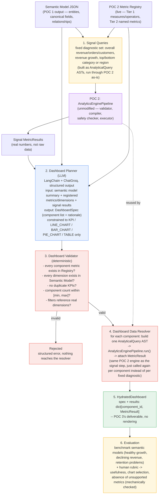

# POC 3 — High-Level Design

## Dashboard Generation (InsightFlow)

> **Status:** Draft — design plan, not yet implemented. Mirrors the shape of
> `poc2_analytics_engine/docs/hld.md` (written before POC 2 existed, revised at closure to match
> what shipped) but for a POC that hasn't started: the "Open questions for implementation" section
> below is genuinely open, not yet resolved. Companion doc: `../../../claude/poc3_dashboard_generation_scope.md`
> in the Claude project has the fuller scoping write-up this HLD compresses into a pipeline diagram.

## Scope decided so far

- **LLM only picks shape, never computes numbers.** A `DashboardPlanner` (LangChain + ChatGroq,
  same provider POC 1/POC 2 use) decides *which* components go on the dashboard. Every number on
  the dashboard is computed by re-running POC 2's existing `AnalyticsEnginePipeline` — POC 3 adds
  no second arithmetic path (architecture doc §2.1, §32.1).
- **Reuses POC 2's types unmodified.** `AnalyticalQuery` (AST) and `MetricResult` are not
  reinvented for dashboards — POC 3 builds one AST per dashboard component and gets back the same
  `MetricResult` shape POC 2 already produces. This is the concrete mechanism behind the
  architecture doc's "shared substrate for two future callers" note in POC 2's own HLD (§24 above
  that doc's diagram) — POC 3 is the first of those two callers to actually exist.
- **Planner is constrained to what's real, not what's imaginable.** The planner only ever sees the
  live `MetricRegistry` contents and the semantic model's actual entities/fields — never raw
  source columns, never a metric that isn't registered. A spec referencing anything else is a
  validator rejection, not a runtime surprise (same discipline as POC 2's AST Validator).
- **v1 component types are capped to what POC 2 can back today**: `KPI`, `LINE_CHART`,
  `BAR_CHART`, `PIE_CHART`, `TABLE`. The architecture doc's fuller list (`HEATMAP`, `FUNNEL`,
  `COHORT`, `SCATTER`) needs B3/B4 metric primitives — percentile, correlation, cohort curves —
  that aren't in POC 2's registry yet, so the planner is never given those types as an option.
- **Signals are pre-computed, not left for the LLM to notice.** Before planning, POC 3 runs a
  small fixed set of diagnostic queries through POC 2 (overall revenue/orders/customers, revenue
  growth, top/bottom category or region if those dimensions exist) and hands the planner real
  numbers, not just field names — this is what makes "revenue declining → emphasize revenue trend
  + category contribution" (architecture doc §13.2) possible without asking the LLM to eyeball
  raw data.
- **No rendering in POC 3.** Output stops at a hydrated JSON spec. Phase 8's React frontend owns
  turning that into an actual dashboard — same "don't build the full stack at once" discipline
  §32.5 names explicitly.
- **"Business type" is named as an open gap, not solved.** Neither POC 1's semantic model nor
  POC 2's registry captures anything like "this is a fashion retailer" — see Open Questions below.

---



---

## Dashboard Spec DSL — sketch

Two layers, matching POC 2's AST/result split — a pre-data spec the planner emits, and a
post-data spec POC 3 actually ships:

```text
DashboardSpec                    (planner output, pre-data, LLM-produced)
├── title: str
├── narrative: str               # one-line "why these components" -- surfaced, not hidden
├── filters: list[FilterSpec]    # only dimensions that actually exist in the semantic model
└── components: list[ComponentSpec]
      ├── type: KPI | LINE_CHART | BAR_CHART | PIE_CHART | TABLE
      ├── metric_name: str       # must resolve in MetricRegistry -- validator-checked
      ├── dimension: str | None  # required for chart types, must exist in semantic model
      ├── time_grain: str | None # e.g. "month" -- LINE_CHART only
      └── rationale: str         # carried through so the "why" survives to the hydrated output

HydratedDashboard                (POC 3's actual deliverable, post-validation, post-data)
├── spec: ValidatedDashboardSpec
└── results: dict[component_id, MetricResult]   # POC 2's MetricResult, reused as-is
```

Reusing `MetricResult` unmodified rather than inventing a parallel result type is the main lever
for minimal-change pluggability into the eventual FastAPI app: a future dashboards endpoint can
share serialization code with the analytics endpoint POC 2 will already have.

---

## Notes

- **Why the LLM only runs once, at planning, and never again.** Every other stage — signal
  gathering, validation, per-component data resolution — is deterministic and reuses POC 2
  unchanged. This keeps POC 3's only non-deterministic surface small enough to prompt-engineer and
  evaluate in isolation, same reasoning as POC 2 keeping the AST/compiler boundary sharp.
- **Why signals are computed before planning instead of letting the planner reason from field
  names alone.** A planner that only sees "there is a `category` dimension and a `revenue`
  measure" has no way to know revenue is declining or which category is driving it — it would be
  guessing at relevance. Running the same fixed small diagnostic set through POC 2 first and
  handing back real `MetricResult`s turns "data-aware" from an aspiration (architecture doc §13.2)
  into something mechanically true.
- **Why validation is a separate deterministic stage rather than trusting the LLM's structured
  output.** LangChain's structured-output mode constrains the *shape* of what the LLM returns, not
  whether the *content* is real — a syntactically valid `ComponentSpec` can still name a metric
  that doesn't exist in this registry, or a dimension this semantic model doesn't have. The
  Validator is what POC 2's AST Validator already proved out for a different input shape; POC 3
  repeats the pattern rather than assuming structured-output guarantees are enough on their own.
- **Why component types are capped at five for v1, not the architecture doc's full list of nine.**
  `HEATMAP`, `FUNNEL`, `COHORT`, `SCATTER` all depend on B3/B4 analytics primitives (correlation,
  cohort-relative time indexing, funnel step sequencing) that don't exist in POC 2's registry yet
  per `metrics_catalog.md`'s bucket classification. Naming them as planner options before the
  underlying metric exists would let the planner emit specs the resolver can never hydrate.
- **Why `MetricResult` is reused rather than given a dashboard-specific wrapper.** A chart
  component and a chatbot answer (POC 4) are both, mechanically, "run one AST, get one typed
  result" — keeping the result type identical is what lets POC 4 later reuse this same resolver
  logic for ad-hoc NL dashboard requests instead of building a third variant.

---

## Open questions for implementation

- **Shared semantic-model dependency — resolved.** This POC originally vendored a second,
  byte-for-byte copy of POC 2's entire engine (not just `SemanticModel`) rather than depending on
  POC 2 directly, for the cross-venv reason this question originally described. That held up
  through POC 3's initial build and both real-Olist runs, but cost a manual second fix each time a
  real bug turned up in the shared code (the join-fan-out fix and the `HAVING_RATIO`
  cross-entity fix — both documented in `docs/real_world_integration_test.md` and
  `docs/class_diagram.md`). After the second one, extracted exactly the small shared local package
  this question anticipated: `insightflow-core`, installed editable into each POC's still-fully-
  separate venv via a local path dependency (`pyproject.toml`'s `[tool.uv.sources]`) — see
  `insightflow_core/README.md` for the full rationale, and its own note on why this is a plain
  path dependency rather than a `uv` workspace (a workspace would merge venvs across POCs, the
  thing "no shared virtual environment between POCs" rules out). POC 4 should depend on this same
  package from day one rather than vendoring a third copy.
- **"Business type" as a planner input.** Not derivable from anything POC 1/POC 2 currently
  capture. Options: infer heuristically from category/product-name text via the LLM itself, accept
  it as an optional free-text field at project-creation time, or defer entirely to a v2 backlog
  item. This is a product decision as much as an engineering one.
- **Benchmark semantic models for evaluation — resolved.** Constructed, not sourced: two
  synthetic datasets (`examples/benchmark_declining_revenue/`, `examples/benchmark_retention_problem/`),
  same entity shape as this POC's own `data/` sample (`bootstrap_registry()` reused unchanged),
  each with a deliberately-engineered growth-signal shape and independently-computed expected
  values (`data/expected_values.json` per case, generated in plain Python, verified against the
  real engine in `tests/test_benchmark_datasets.py`) rather than hand-picked from a real dataset
  that happened to fit. The declining-revenue case makes `revenue_growth`/`order_growth`/
  `customer_growth` all clearly negative; the retention-problem case makes all three clearly
  *positive* while `repeat_purchase_rate` is far below healthy — the harder case, since nothing
  about it is mechanically rejectable (`DashboardValidator` has no rule against "growth looks
  fine"), so the evaluation step really is a rubric judgment, not a second mechanical check in
  disguise. Real-Groq-call runs against both are pending — see each folder's own README for the
  rubric to apply once run.
- **Planner prompt strategy.** Single LLM call producing the full `DashboardSpec` at once, versus
  a two-step planner (first decide *themes* — "emphasize decline," "emphasize retention" — then
  fill in components per theme)? Undecided until real prompting against the benchmark cases
  surfaces whether one call reliably avoids redundant or low-value components.
- **Filter validity beyond existence.** The Validator checks that a filter's dimension exists in
  the semantic model, but not yet whether it's *useful* (e.g. a region filter with only one
  distinct value). Whether that's worth checking mechanically or left to the planner's judgment is
  open.
