# POC 4 — Class Diagram

## Natural Language Analytics Chatbot (InsightFlow)

> **Status:** Draft — drawn before implementation, per `poc1_schema_discovery/docs/class_diagram.md`,
> `poc2_analytics_engine/docs/class_diagram.md`, and `poc3_dashboard_generation/docs/class_diagram.md`'s
> own pattern of finalizing classes/methods on paper first. Nothing below has been built yet, so
> "Decisions made during implementation" and closure-sweep sections don't exist here the way they
> do in POC 2/3's diagrams — this is the pre-implementation sketch those sections would eventually
> react to.
>
> **Found while drawing this diagram (worth flagging now, before code, same as POC 2's diagram
> flagging the join-path gap early and POC 3's flagging the `LINE_CHART` gap early):** `hld.md`'s
> pipeline sketch treats "which category caused the revenue decline last quarter" as a single
> `GROWTH` query grouped by category, but `insightflow_core`'s `AnalyticalQuery` model
> (`query.py`) makes `dimension` valid **only** when `operation=GROUP_BY`, and `growth` valid
> **only** when `operation=GROWTH` — the two are mutually exclusive on one AST node, by
> construction. There is no way to express "growth, broken down by category" as one
> `AnalyticalQuery`. This is answerable without any new `insightflow_core` primitive, though: run
> **two** `GROUP_BY` queries (same metric, same dimension, one `time_filter` per period) through
> the unmodified engine, then diff the two `MetricResult`s per-category in plain deterministic
> Python — no LLM arithmetic, just composition of two already-supported calls, the same shape of
> move `SignalGatherer` (POC 3) and the `RATIO`/`AOV` split-subquery fix (`insightflow_core`) both
> already use. Modeled below as `QuestionOperation.GROWTH_BY_DIMENSION` (a POC 4-level planning
> concept) decomposed by `QueryAssembler` into two `AnalyticalQuery` objects plus a deterministic
> `ResultDiffer` — not a new `OperationType` on the shared AST itself.

```mermaid
classDiagram
    direction LR

    %% ==========================
    %% Imported from POC 1 (not owned by POC 4, not redesigned)
    %% ==========================

    class SemanticField {
        <<from POC 1>>
        +name: str
        +source_column: str
        +source_file: str
        +confidence: float
    }

    class Entity {
        <<from POC 1>>
        +name: str
        +fields: List~SemanticField~
    }

    class SemanticModel {
        <<from POC 1>>
        +entities: List~Entity~
        +relationships: List~Relationship~
    }

    SemanticModel "1" *-- "many" Entity
    Entity "1" *-- "many" SemanticField

    %% ==========================
    %% Imported from insightflow_core (unmodified — reused, not redesigned)
    %% ==========================

    class OperationType {
        <<enumeration, from insightflow_core>>
        AGGREGATE
        GROUP_BY
        GROWTH
    }

    class TimeFilter {
        <<from insightflow_core>>
        +start_date: date
        +end_date: date
    }

    class GrowthSpec {
        <<from insightflow_core>>
        +current_period: TimeFilter
        +comparison_period: TimeFilter
    }

    class AnalyticalQuery {
        <<from insightflow_core>>
        +operation: OperationType
        +metric: str
        +dimension: Optional~str~
        +time_filter: Optional~TimeFilter~
        +growth: Optional~GrowthSpec~
        +sort: Optional~SortSpec~
        +limit: Optional~int~
    }

    class MetricKind {
        <<enumeration, from insightflow_core>>
        BASE
        RATIO
        GROWTH
        HAVING_RATIO
    }

    class MetricDefinition {
        <<from insightflow_core>>
        +name: str
        +kind: MetricKind
    }

    class MetricRegistry {
        <<from insightflow_core>>
        +resolve(name: str) Measure|MetricDefinition
        +is_registered(name: str) bool
        +all_metric_names() List~str~
    }

    class ValidationError {
        <<from insightflow_core>>
        +code: str
        +message: str
        +field: str
    }

    class ValidationResult {
        <<from insightflow_core>>
        +is_valid: bool
        +errors: List~ValidationError~
    }

    class ASTValidator {
        <<from insightflow_core>>
        +validate(query: AnalyticalQuery) ValidationResult
    }

    class MetricResult {
        <<from insightflow_core>>
        +metric_name: str
        +value: Optional~float~
        +rows: Optional~List~Dict~~~
        +metadata: QueryMetadata
    }

    class AnalyticsEnginePipeline {
        <<from insightflow_core>>
        +run(query: AnalyticalQuery) MetricResult
    }

    AnalyticalQuery --> OperationType
    AnalyticalQuery --> TimeFilter
    AnalyticalQuery --> GrowthSpec
    ASTValidator --> AnalyticalQuery : validates
    ASTValidator --> ValidationResult : produces
    ValidationResult "1" *-- "many" ValidationError
    MetricRegistry ..> MetricDefinition : stores
    MetricDefinition --> MetricKind
    AnalyticsEnginePipeline --> AnalyticalQuery : accepts
    AnalyticsEnginePipeline --> MetricResult : returns
    AnalyticsEnginePipeline --> ASTValidator : uses internally

    %% ==========================
    %% POC 4: Time resolution (deterministic — never LLM date arithmetic)
    %% ==========================

    class TimeExpression {
        <<enumeration>>
        THIS_MONTH
        LAST_MONTH
        THIS_QUARTER
        LAST_QUARTER
        THIS_YEAR
        LAST_YEAR
        ALL_TIME
    }

    class TimeExpressionResolver {
        +reference_date: date
        +resolve_time_filter(expr: TimeExpression) TimeFilter
        +resolve_growth_spec(expr: TimeExpression) GrowthSpec
        -period_bounds(expr: TimeExpression) tuple~date, date~
        -preceding_calendar_period(expr: TimeExpression, period: TimeFilter) TimeFilter
        -preceding_equal_length_period(period: TimeFilter) TimeFilter
    }

    TimeExpressionResolver --> TimeExpression : consumes
    TimeExpressionResolver --> TimeFilter : produces
    TimeExpressionResolver --> GrowthSpec : produces

    %% ==========================
    %% POC 4: Question Intent (planner output, pre-resolution)
    %% ==========================

    class QuestionOperation {
        <<enumeration>>
        AGGREGATE
        GROUP_BY
        GROWTH
        GROWTH_BY_DIMENSION
    }

    class QuestionIntent {
        +answerable: bool
        +reason: Optional~str~
        +metric_name: Optional~str~
        +operation: Optional~QuestionOperation~
        +dimension: Optional~str~
        +time_expression: Optional~TimeExpression~
    }

    QuestionIntent --> QuestionOperation
    QuestionIntent --> TimeExpression

    %% ==========================
    %% POC 4: Planner
    %% ==========================

    class MetricSummary {
        +name: str
        +kind: str
        +description: str
    }

    class PlannerContext {
        +entities: List~str~
        +available_dimensions: List~str~
        +available_metrics: List~MetricSummary~
        +groupable_metrics: List~str~
        +growth_metrics: List~str~
        +supported_time_expressions: List~TimeExpression~
    }

    class QuestionPlanner {
        +llm_client: ChatGroq
        +plan(question: str, context: PlannerContext) QuestionIntent
        -build_prompt(question: str, context: PlannerContext) str
        -parse_structured_output(raw: Any) QuestionIntent
    }

    QuestionPlanner --> PlannerContext : consumes
    QuestionPlanner --> QuestionIntent : produces
    PlannerContext "1" *-- "many" MetricSummary

    %% ==========================
    %% POC 4: AST assembly (deterministic)
    %% ==========================

    class ResolvedQuery {
        +intent: QuestionIntent
        +queries: List~AnalyticalQuery~
    }

    class QueryAssembler {
        +time_resolver: TimeExpressionResolver
        +assemble(intent: QuestionIntent) ResolvedQuery
        -assemble_simple(intent: QuestionIntent) AnalyticalQuery
        -assemble_growth_by_dimension(intent: QuestionIntent) List~AnalyticalQuery~
    }

    QueryAssembler --> TimeExpressionResolver : uses
    QueryAssembler --> QuestionIntent : consumes
    QueryAssembler --> ResolvedQuery : produces
    ResolvedQuery --> QuestionIntent
    ResolvedQuery "1" *-- "many" AnalyticalQuery

    %% ==========================
    %% POC 4: Pre-execution validation (reuses insightflow_core's ASTValidator directly)
    %% ==========================

    class QuestionValidator {
        +ast_validator: ASTValidator
        +validate(resolved: ResolvedQuery) ValidationResult
    }

    QuestionValidator --> ASTValidator : delegates to (unmodified, reused)
    QuestionValidator --> ResolvedQuery : validates
    QuestionValidator --> ValidationResult : produces

    %% ==========================
    %% POC 4: Execution + deterministic diffing
    %% ==========================

    class CategoryDelta {
        +dimension_value: str
        +current_value: Optional~float~
        +comparison_value: Optional~float~
        +delta: Optional~float~
        +pct_change: Optional~float~
    }

    class ResultDiffer {
        +diff(current: MetricResult, comparison: MetricResult) List~CategoryDelta~
    }

    class QuestionResult {
        +metric_result: Optional~MetricResult~
        +category_deltas: Optional~List~CategoryDelta~~
    }

    class QuestionExecutor {
        +engine: AnalyticsEnginePipeline
        +differ: ResultDiffer
        +execute(resolved: ResolvedQuery) QuestionResult
    }

    QuestionExecutor --> AnalyticsEnginePipeline : uses (unmodified, reused)
    QuestionExecutor --> ResultDiffer : uses
    QuestionExecutor --> ResolvedQuery : consumes (validated)
    QuestionExecutor --> QuestionResult : produces
    ResultDiffer --> CategoryDelta : produces
    QuestionResult "1" *-- "many" CategoryDelta
    QuestionResult --> MetricResult

    %% ==========================
    %% POC 4: Insight generation (LLM, explanation only)
    %% ==========================

    class InsightGenerator {
        +llm_client: ChatGroq
        +explain(question: str, result: QuestionResult) str
    }

    InsightGenerator --> QuestionResult : consumes (never recomputes it)

    %% ==========================
    %% POC 4: Answer (deliverable)
    %% ==========================

    class Answer {
        +question: str
        +refused: bool
        +reason: Optional~str~
        +result: Optional~QuestionResult~
        +explanation: str
    }

    Answer --> QuestionResult

    %% ==========================
    %% POC 4: Orchestration
    %% ==========================

    class QuestionAnsweringPipeline {
        +semantic_model: SemanticModel
        +registry: MetricRegistry
        +engine: AnalyticsEnginePipeline
        +planner: QuestionPlanner
        +assembler: QueryAssembler
        +validator: QuestionValidator
        +executor: QuestionExecutor
        +insight_generator: InsightGenerator
        +answer(question: str) Answer
    }

    QuestionAnsweringPipeline --> QuestionPlanner : uses
    QuestionAnsweringPipeline --> QueryAssembler : uses
    QuestionAnsweringPipeline --> QuestionValidator : uses
    QuestionAnsweringPipeline --> QuestionExecutor : uses
    QuestionAnsweringPipeline --> InsightGenerator : uses
    QuestionAnsweringPipeline --> Answer : returns

    %% ==========================
    %% POC 4: Evaluation
    %% ==========================

    class QuestionFixture {
        +question: str
        +expected_answerable: bool
        +expected_metric: Optional~str~
        +expected_operation: Optional~QuestionOperation~
        +expected_value: Optional~float~
    }

    class AnswerEvaluationReport {
        +total: int
        +intent_correct: int
        +plan_correct: int
        +numerically_correct: int
        +refusal_correct: int
        +hallucinations: int
        +summary() str
    }

    class AnswerEvaluator {
        +pipeline: QuestionAnsweringPipeline
        +evaluate(fixtures: List~QuestionFixture~) AnswerEvaluationReport
    }

    AnswerEvaluator --> QuestionAnsweringPipeline : uses
    AnswerEvaluator --> QuestionFixture : consumes
    AnswerEvaluator --> AnswerEvaluationReport : produces
```

## Notes

- **`QuestionValidator` wraps `ASTValidator` rather than reimplementing its checks — a different
  reuse shape than POC 3's `DashboardValidator`.** POC 3's validator is a *new* class with its own
  overlapping rules, deliberately duplicating some of what POC 2's `ASTValidator` would catch
  anyway, because it needed spec-level, component-attributed errors `ASTValidator` has no way to
  produce for a five-component dashboard. POC 4 has no such need — one question produces one or two
  plain `AnalyticalQuery` objects, and `ASTValidator`'s own `ValidationResult`/`ValidationError`
  shape is already exactly what a refusal message needs. So `QuestionValidator` is a thin wrapper:
  call the *same* `ASTValidator` instance the engine's own `AnalyticsEnginePipeline` uses,
  explicitly, before `engine.run()`, and turn a failing `ValidationResult` into a clean refusal
  `Answer` instead of letting `AnalyticsEnginePipeline.run()` raise a bare `ValueError` that would
  need to be caught. Same principle as POC 3 ("fail fast and legibly before execution"), lighter
  implementation because the existing validator's output shape already fits.
- **`GROWTH_BY_DIMENSION` is a POC 4-only planning concept, not a new `insightflow_core`
  `OperationType`.** Per the banner note above, the shared AST has no way to express "growth,
  grouped by dimension" on one node. `QueryAssembler.assemble_growth_by_dimension` builds two
  ordinary `GROUP_BY` queries (current period, comparison period; same metric, same dimension) and
  hands both to `QuestionExecutor`, which runs each through the unmodified engine and calls
  `ResultDiffer` to compute per-category deltas in plain Python. This keeps the "no new engine
  primitive" constraint from `hld.md` intact — the composition lives entirely in POC 4's own code,
  the same way POC 3's `SignalGatherer` composes multiple existing `AnalyticalQuery` calls instead
  of asking POC 2 for a new one.
- **Why `GROWTH_BY_DIMENSION`'s two queries must both target a `BASE`-kind metric, not a
  `GROWTH`-kind one.** `ASTValidator._validate_group_by_supported` (already in `insightflow_core`,
  unmodified) rejects `GROUP_BY` against anything but a bare measure or a `BASE` metric — a
  `GROWTH`-kind metric like `revenue_growth` can only be queried with `operation=GROWTH` and no
  `dimension` at all (`AnalyticalQuery`'s own validator enforces this). So a "which category
  caused the decline" question must resolve `metric_name` to the *base* measure (`revenue`), not
  the pre-built `revenue_growth` metric — `PlannerContext.groupable_metrics` needs to reflect this
  distinction from `growth_metrics` so the planner is never offered a combination the validator
  would reject, the same lesson POC 3's real-Groq runs learned the hard way (see
  `poc3_dashboard_generation/docs/class_diagram.md`'s "Found via a second real Groq/real-Olist
  run").
- **Refusal short-circuits before `InsightGenerator`.** `hld.md` left this as an open question;
  this diagram takes the position it was already leaning toward: if `QuestionIntent.answerable`
  is `False` or `QuestionValidator` rejects the assembled query, `QuestionAnsweringPipeline.answer`
  returns an `Answer` with `refused=True` and `explanation` set directly from the deterministic
  reason string — no LLM call. This is provisional, not a closure of that open question; worth
  revisiting once real questions are run through the pipeline, same way POC 3 revised assumptions
  after real Groq calls.
- **`TimeExpressionResolver.reference_date` is a required constructor input, never
  `date.today()`.** Carried over from `hld.md`'s note: a static historical dataset (Olist ends in
  2018) makes wall-clock "today" meaningless for resolving `LAST_QUARTER`. Modeled as a plain field
  here rather than a method parameter so `QueryAssembler` doesn't need to know where it came from —
  `QuestionAnsweringPipeline`'s constructor is where a one-time `MAX(order_date)`-style signal
  query result would be threaded in.
- **`AnalyticalQuery`/`MetricResult` are reused unmodified, same lever POC 3's own diagram already
  used this reasoning for.** `QuestionResult` wraps `MetricResult` rather than replacing it — for
  the simple `AGGREGATE`/`GROUP_BY`/`GROWTH` cases `metric_result` is set directly; only the
  decomposed `GROWTH_BY_DIMENSION` case populates `category_deltas` instead. A future FastAPI chat
  endpoint can share serialization code with the analytics and dashboard endpoints Phase 5 will
  already have, the same "minimal-change pluggability" argument POC 3's `HydratedDashboard` made.
- **`MetricSummary`/`PlannerContext` shape mirrors POC 3's classes of the same name, not shared
  code.** `insightflow_core` deliberately has no LLM-facing types (its own README states this).
  POC 3 and POC 4 each keep their own small planner-context types, same as each keeping its own
  `registry/bootstrap.py` — business/prompt configuration, not shared engine logic.
- **`LLMClient`/`GroqLLMClient` are expected to be vendored into POC 4** the same way POC 3
  vendored them from POC 1 (`poc3_dashboard_generation/src/insightflow/llm/`) — not drawn in this
  diagram since they're unchanged plumbing, not a POC 4 design decision. Small, deliberate
  duplication, same reasoning as `registry/bootstrap.py`'s duplication across POC 2/3.

## M3 real-data findings (real Olist output, no real Groq call)

`tests/test_real_olist_integration.py` runs the deterministic layer (no planner LLM — hand-built
`QuestionIntent`s, same "hand-built spec, no planner" shape as `poc3_dashboard_generation`'s own
M2) against POC 1's actual (small, 8-order) Olist output, copied byte-for-byte into
`examples/real_olist_integration/data/` per the top-level README's "self-contained POC" rule.
Two real, previously-undiscovered bugs found and fixed directly in `insightflow_core` (both
regression-tested there, both applying to POC 2/3 as well since it's shared code):

1. **`ASTValidator` never checked whether a plain `AGGREGATE`/`GROUP_BY` query's entity has a time
   field before applying a `time_filter`.** The equivalent check already existed for `GROWTH`
   (`_validate_growth`'s `has_time_field` check), but was never generalized. A query for real
   Olist's `revenue` (a bare measure on `payments`, which has no `transaction_date` column) with
   any `time_filter` — including one produced by `TimeExpression.ALL_TIME` — crashed with an
   unhandled `KeyError` deep inside `SQLCompiler`/`FieldResolver` instead of failing validation
   cleanly. **Fixed**: new `ASTValidator._validate_time_filter_entity_has_time_field`, covering
   bare measures, `BASE`-kind, and `RATIO`-kind metrics (checking both sides for `RATIO`).
   Regression tests in `insightflow_core/tests/test_ast_validator.py`.
2. **`QueryAssembler` was resolving `TimeExpression.ALL_TIME` to an explicit bounded
   `TimeFilter`** (dataset min-date to reference-date) instead of treating it as "no
   restriction" — semantically wrong regardless of the bug above (a metric whose entity has a
   time field would have silently gotten a *narrower* filter than "no filter at all" implies),
   and the bug above is what surfaced it. **Fixed**: `QueryAssembler._resolve_optional_time_filter`
   now treats `time_expression is None` and `time_expression == ALL_TIME` identically for
   `AGGREGATE`/`GROUP_BY` — both omit `time_filter` entirely.

A third, deeper gap was flagged first, then **also fixed** in a follow-up pass (originally
deferred as too invasive for the same change as the two fixes above, then done as its own
deliberate change once confirmed safe): a `GROWTH` query whose comparison-period count is `0`
produces a legitimately-`NULL` scalar (`NULLIF(0, 0)`), but `MetricResult`'s old invariant
(`_exactly_one_of_value_or_rows`, inferring shape from which of `value`/`rows` was non-`None`)
couldn't represent "computed, but undefined" — it raised a `ValidationError` instead of returning
`value=None`. **Fixed** by adding an explicit `MetricResult.shape: Literal["scalar", "grouped"]`
field, sourced directly from `CompiledQuery.result_shape` (which already existed one layer
earlier in the pipeline) rather than inferred from field presence — `shape="scalar"` with
`value=None` now means exactly "computed, mathematically undefined," not "malformed." This
rippled across all three POCs since `MetricResult` is `insightflow_core`'s shared contract:
- `QueryExecutor.execute` now passes `shape=` explicitly.
- Every hand-built `MetricResult` in `insightflow_core`'s, POC 3's, and POC 4's own test suites
  needed a `shape=` argument added (a loud, test-time-visible break, not a silent one).
- POC 3's `SignalGatherer.gather()` used to rely on the *crash* from the old invariant (caught by
  a broad `except Exception`) to drop an infeasible growth signal from the planner's context; now
  that the same query returns cleanly with `value=None` instead of raising, `gather()` gained an
  explicit `if result.shape == "scalar" and result.value is None: continue` check — the same
  outcome (an undefined signal is still omitted), reached deliberately instead of by accident.
  `DashboardPlanner._format_signal` was updated the same way, branching on `shape` instead of
  value-presence.
- POC 4's `InsightGenerator._build_prompt` had the identical latent bug (branching on
  `mr.value is not None` to pick scalar-vs-grouped formatting) — a scalar-but-undefined result
  would have hit the grouped branch and crashed iterating `mr.rows` (`None`). Fixed the same way,
  now also rendering an undefined scalar as an explicit "undefined (mathematically undefined for
  this period)" string in the prompt rather than crashing or silently showing nothing.

Regression tests: `insightflow_core/tests/test_query_models.py` (six `MetricResult` shape tests,
replacing the two the old invariant had), and
`poc4_nl_chatbot/tests/test_real_olist_integration.py::test_growth_from_a_zero_comparison_period_returns_an_undefined_scalar_not_a_crash`
— the exact real scenario (`order_growth`, `LAST_YEAR` 2017 vs. zero-order 2016) that originally
surfaced this gap, now asserting `shape="scalar"`, `value=None`, `rows=None` instead of a raised
`ValidationError`. Full repo-wide test sweep after this fix: 187 tests passing across all five
packages (47 `insightflow_core` + 10 POC 1 + 16 POC 2 + 46 POC 3 + 68 POC 4).

Two more findings, confirming rather than changing behavior — real POC 1 output re-validates two
decisions already made above:

3. **`category`/`region` are genuinely ambiguous in real POC 1 output** (`category`: both
   `products` and `category_translation`; `region`: both `customers` and `sellers`) — exactly the
   case `poc3_dashboard_generation`'s own real-Groq run first surfaced.
   `build_planner_context`'s `FieldResolver.find_entity_for_field` filter excludes both from
   `available_dimensions`, and `QuestionValidator` independently rejects either as
   `ambiguous_dimension` if ever assembled anyway — both layers of the defense-in-depth checked.
4. **Every ID field is *also* ambiguous in real Olist output** (`order_id`, `customer_id`,
   `product_id` are each repeated verbatim across multiple entities as foreign keys) — a new
   observation, not previously documented by POC 2/3 (their own validator tests only exercised the
   `category`/`region` collision). Combined with finding 3, `available_dimensions` collapses to a
   single field (`price`, from `order_items`) for this real dataset — which is a continuous
   numeric field, not a categorical one. **Flagged as a backlog item, not fixed**:
   `build_planner_context` only filters for existence/unambiguity, not for "is this a sensible
   dimension to group by" — a real planner LLM could still be offered `price` as a `dimension` and
   produce a technically-valid but nonsensical `GROUP BY revenue by price`. Would need either a
   dimension-shaped-field heuristic or `PlannerContext` distinguishing categorical from continuous
   fields.

## Open questions for implementation

All six resolved in this session, before implementation started:

- **`GROWTH_BY_DIMENSION` category-set mismatch — resolved: zero-fill.** `ResultDiffer` treats a
  dimension value missing from either side as `0` for that side (a full-outer-join-then-subtract,
  not an inner join). A category with revenue last period and none this period is often the
  *strongest* possible answer to "what caused the decline" — dropping it would hide exactly the
  signal the question is asking for. This also keeps the diff a pure set-union operation with no
  special-casing for a category appearing on only one side.
- **`ResultDiffer` ranking convention — resolved: signed absolute delta, top 3.** Rank
  `CategoryDelta`s by `current_value - comparison_value` (most negative first for a decline
  question), not `pct_change` — `pct_change` is undefined when the zero-fill above makes
  `comparison_value == 0`, the same divide-by-zero shape `insightflow_core` already guards
  elsewhere with `NULLIF` (`_compile_ratio`, `_compile_growth`). `pct_change` is still computed and
  carried on `CategoryDelta` for display, but as `None` (not an error) when its denominator is
  `0`. `InsightGenerator`'s prompt sees the top 3 categories by that ranking — enough to answer
  "which category," not a full table the LLM has to summarize itself.
- **`TimeExpression` enum coverage — resolved: ship the 7 values, no parametric value in v1.**
  `LAST_N_DAYS(n)`-style parametrization is deferred until a real benchmark question set
  demonstrates the fixed enum can't express something actually asked — matches the project's
  evaluation-driven discipline (`hld.md` §8/architecture doc §26) rather than covering a
  hypothetical case speculatively.
- **`GrowthSpec`'s comparison-period convention — resolved: always immediately-preceding.** No
  planner-selectable QoQ-vs-YoY axis in v1. Complete calendar periods (`LAST_MONTH`/`LAST_QUARTER`/
  `LAST_YEAR`) use `preceding_calendar_period`; to-date and open periods use
  `preceding_equal_length_period` -- for both plain `GROWTH` and `GROWTH_BY_DIMENSION`. (Revised in
  Phase 8 M6: equal-length alone misaligned calendar periods of different lengths -- Q2 2018 vs
  Dec 31-Mar 31 on real Olist data.) Keeps the planner's job pure classification (pick one of 7 enum
  values) rather than adding a second dimension of choice it could get wrong; if a benchmark
  question genuinely needs YoY, add it as its own explicit `TimeExpression` value later (e.g.
  `LAST_QUARTER_YOY`) rather than a free parameter on `GrowthSpec` resolution.
- **Refusal benchmark set — resolved: build it now, alongside the answerable fixtures, not
  deferred.** `QuestionFixture` (evaluation section above) gets ~15-20 unanswerable cases from day
  one, covering four categories that map directly onto `ASTValidator`'s actual rejection codes
  (reusing real, already-discovered rejection reasons rather than inventing synthetic ones):
  unregistered metric (architecture doc §16's own conversion-rate example), unknown dimension,
  ambiguous dimension (Olist's real `category`/`region` collision — the exact case POC 3's own
  diagram documents finding), and a metric/operation combination `ASTValidator` already rejects
  (e.g. `HAVING_RATIO` + `time_filter`). Cheap to write now since expected behavior (refuse, with
  reason X) needs no real LLM call to define — only to verify later.
- **Where `reference_date` is sourced at runtime — resolved: computed once at pipeline
  construction, not per-question.** A single `MAX(order_date)`-style signal query (same
  signal-query pattern POC 3 already established) runs once when `QuestionAnsweringPipeline` is
  constructed, and the result is held for the pipeline's lifetime. Nothing in v1's scope re-ingests
  data mid-session, so recomputing it per question would be pure waste with no correctness
  benefit.
