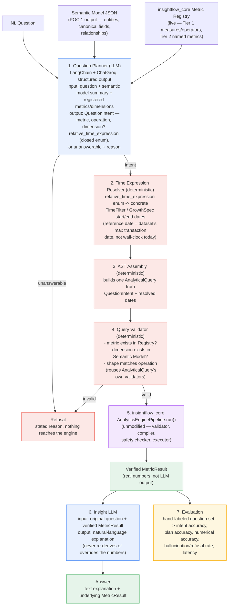

# POC 4 — High-Level Design

## Natural Language Analytics Chatbot (InsightFlow)

> **Status:** Draft — design plan, not yet implemented. Mirrors the shape of
> `poc3_dashboard_generation/docs/hld.md` (written before POC 3 existed, revised at closure to
> match what shipped) but for a POC that hasn't started: the "Open questions for implementation"
> section below is genuinely open, not yet resolved. Scoping (objectives, success metrics, scope
> boundaries) was worked out in conversation rather than a separate companion doc — this HLD is
> that scoping compressed into a pipeline diagram, same relationship POC 3's HLD had to its own
> scope write-up.

## Scope decided so far

- **LLM plans and explains; it never computes.** A `QuestionPlanner` (LangChain + ChatGroq, same
  provider POC 1–3 use) turns the NL question into a structured intent. Every number in the answer
  comes from re-running `insightflow_core`'s existing `AnalyticsEnginePipeline` — POC 4 adds no
  second arithmetic path (architecture doc §2.1, §32.1), same discipline POC 2 and POC 3 already
  established.
- **Reuses `insightflow_core` unmodified, and directly — not vendored.** `AnalyticalQuery`,
  `MetricResult`, `MetricRegistry`, and `AnalyticsEnginePipeline` are depended on the same way
  POC 3 depends on them (local editable path dependency, own isolated venv). No third hand-kept
  copy — see `insightflow_core/README.md`'s own note naming POC 4 as the intended next consumer.
- **Relative dates resolve deterministically, not via LLM date arithmetic.** The AST's
  `TimeFilter`/`GrowthSpec` already require explicit `start_date`/`end_date`
  (`insightflow_core/models/query.py`) — no engine change needed. The planner LLM picks a
  **closed enum** of relative-time expressions (e.g. `last_quarter`, `last_month`, `last_year`,
  `all_time`); a deterministic `TimeExpressionResolver` turns the chosen enum value into concrete
  dates. The LLM never emits a date itself. This was an explicit decision this session, favoring
  determinism over letting the LLM reason about calendars.
- **One question, one metric, one AST.** Matches the AST's existing one-metric-per-query
  constraint. Multi-metric questions ("show me revenue and orders") are out of scope for v1 — see
  Non-goals.
- **No new engine primitives.** `AGGREGATE`, `GROUP_BY`, and `GROWTH` — the three operations
  already implemented — cover the architecture doc's own worked example (§15: "which category
  caused the revenue decline last quarter" is a `GROWTH` query grouped by category, both periods
  resolved deterministically). If a real question needs a primitive the engine doesn't have (e.g.
  true time-bucketing for a trend line), that's a discovered gap to report, not something to build
  around inline.
- **Explicit refusal over hallucination (architecture doc §16).** A question that cannot be
  mapped to a registered metric and an existing semantic-model dimension gets a stated reason, not
  a guess. Checked twice, same defense-in-depth pattern POC 2's AST Validator and POC 3's
  Dashboard Validator already use: once by the planner itself (it can emit "unanswerable" instead
  of a forced-fit intent), and once more by a deterministic Query Validator that re-checks the
  assembled AST against the live registry/semantic model regardless of what the planner claimed.
- **No chart rendering, no persistence, no multi-turn memory in v1.** Output stops at answer text
  plus the underlying verified `MetricResult`. Phase 8 (frontend) and Phase 5/6 (FastAPI,
  persistence) own the rest, same "don't build the full stack at once" discipline (§32.5).

---



---

## Question Intent schema — sketch

Mirrors POC 3's two-layer split (planner output vs. resolved/hydrated form), but for a single
query instead of a dashboard's component list:

```text
QuestionIntent                   (planner output, pre-resolution, LLM-produced)
├── answerable: bool
├── reason: str | None            # required when answerable=False, surfaced verbatim to the user
├── metric_name: str | None       # must resolve in MetricRegistry -- validator-checked
├── operation: AGGREGATE | GROUP_BY | GROWTH | None
├── dimension: str | None         # required for GROUP_BY, must exist in semantic model
└── time_expression: TimeExpression | None
      = LAST_MONTH | LAST_QUARTER | LAST_YEAR | THIS_MONTH | THIS_QUARTER
      | THIS_YEAR | ALL_TIME                     # closed enum -- never a raw date, never free text

ResolvedQuery                    (post date-resolution, pre-validation, fully deterministic)
├── intent: QuestionIntent
└── query: AnalyticalQuery        # insightflow_core's AST, reused as-is -- see query.py

Answer                           (POC 4's actual deliverable)
├── question: str
├── result: MetricResult | None   # insightflow_core's result type, reused as-is; None if refused
├── explanation: str              # Insight LLM output, or the stated refusal reason
└── refused: bool
```

Reusing `AnalyticalQuery` and `MetricResult` unmodified — rather than inventing chatbot-specific
parallel types — is the same "minimal-change pluggability" lever POC 3's HLD called out for its
own `HydratedDashboard`: a future chat endpoint can share serialization code with the analytics
and dashboard endpoints Phase 5 will already have.

---

## Notes

- **Why the LLM runs twice (planner, then insight), never in between.** Everything between
  planning and result — date resolution, AST assembly, validation, execution — is deterministic
  and reuses `insightflow_core` unchanged. This keeps POC 4's non-deterministic surface to exactly
  two prompts, same reasoning as POC 2 keeping the AST/compiler boundary sharp and POC 3 keeping
  the LLM to a single planning call.
- **Why time expressions are a closed enum instead of letting the LLM emit dates or a free-text
  range.** An LLM computing "last quarter" relative to an unstated reference point is exactly the
  kind of arithmetic §2.1 and this session's decision say should never be the LLM's job. A closed
  enum makes the planner's job pure classification (which of ~7 buckets does this question mean),
  and pushes the actual date math into a small, independently testable `TimeExpressionResolver` —
  same "LLM understands, deterministic system calculates" split applied to calendars instead of
  metrics.
- **Why the reference date is the dataset's max transaction date, not wall-clock `today()`.**
  Olist's real data ends in 2018; resolving "last quarter" against today's actual date would
  silently produce an empty window on every real-data run. The resolver needs a
  `reference_date` input threaded from the semantic model / a cheap `MAX(order_date)` signal
  query, not the system clock — flagged here so it isn't discovered late as a bug.
- **Why refusal is checked twice (planner + validator) rather than trusting the planner's own
  `answerable` flag.** Structured-output mode constrains the *shape* of what the LLM returns, not
  whether the *content* is real — a syntactically valid `QuestionIntent` with `answerable=True` can
  still name a metric or dimension that doesn't exist in this registry/semantic model. The Query
  Validator is the same deterministic backstop POC 2's AST Validator and POC 3's Dashboard
  Validator already are for their own input shapes.
- **Why `AnalyticalQuery`/`MetricResult` are reused rather than given chatbot-specific wrappers.**
  A chatbot answer and a dashboard component (POC 3) are both, mechanically, "run one AST, get one
  typed result" — POC 3's own HLD flagged this exact reuse as the reason it kept `MetricResult`
  unwrapped. POC 4 cashes that in rather than building a third variant.

---

## Non-goals for v1 (deferred, not forgotten)

- **Multi-turn conversation.** Follow-up questions referencing prior context ("now break that down
  by region") need conversation state and reference resolution — real chatbot memory, out of scope
  until v1's single-turn path is proven.
- **Multi-metric questions in one query** ("show me revenue and orders together") — blocked by the
  AST's one-metric-per-query design. Would need either sequential AST calls stitched together in
  the answer layer or an AST change; neither is in scope here.
- **RAG / few-shot pattern retrieval (architecture doc §18).** Start with direct structured-output
  planning, same as POC 3's `DashboardPlanner`. Only add retrieval if a real accuracy benchmark
  says direct planning isn't good enough — don't build it speculatively.
- **Any new `insightflow_core` engine primitive** (true time-bucketing, percentile, correlation,
  etc.). If a benchmark question needs one, that's a discovered gap for the backlog, not something
  to patch around inside POC 4.
- **Chart output, chat history persistence, FastAPI wiring.** Phase 8, Phase 5/6 respectively.

---

## Open questions for implementation

All resolved in this session — see `class_diagram.md`'s "Open questions for implementation" for
the full reasoning behind each. Summary:

- **Closed enum coverage — resolved: ship the 7 values above, no parametric value in v1.**
  `LAST_N_DAYS(n)`-style parametrization deferred until a real benchmark demonstrates the fixed
  enum can't express something actually asked.
- **`GROWTH`'s comparison period — resolved: always immediately-preceding.** A complete calendar
  period (`LAST_MONTH`/`LAST_QUARTER`/`LAST_YEAR`) compares with the calendar period before it; a
  to-date or open period (`THIS_*`, `ALL_TIME`) with the equal-length window before it. *Revised in
  Phase 8 M6:* the original equal-length-only rule compared Q2 2018 (91 days) with Dec 31-Mar 31 on
  real Olist data, because calendar periods differ in length. No planner-selectable QoQ-vs-YoY
  choice in v1; add a dedicated enum value later if a benchmark question needs it.
- **Refusal benchmark set — resolved: build it now, alongside the answerable fixtures.** ~15-20
  cases reusing `ASTValidator`'s real rejection codes (unregistered metric, unknown dimension,
  ambiguous dimension, unsupported metric/operation combination), not deferred to a later pass.
- **Where `reference_date` comes from at runtime — resolved: computed once at pipeline
  construction** (a one-time `MAX(order_date)`-style signal query), held for the pipeline's
  lifetime, not recomputed per question.
- **Insight LLM prompt scope — resolved: refusals short-circuit before any LLM call.** A refused
  question's `explanation` is set directly from the deterministic reason string; `InsightGenerator`
  is only invoked for an answerable, successfully-executed question.
